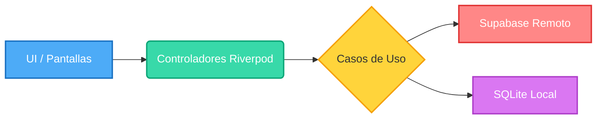

# 📊 Dashboard — BRISMAR APP

> 🔄 **Última actualización automática:** 02 de junio de 2026 a las 01:27
> Vuelve a [[CONTEXTO_PROYECTO]] para el menú principal.
> 📖 **Lectura recomendada:** Comienza por el [[MAPA_MAESTRO]] para entender el flujo paso a paso y los anti-patrones.

---

## Números del proyecto

| Métrica | Valor |
| --- | --- |
| 📄 Archivos Dart | **27** |
| 📝 Líneas de código | **2219** |
| 📦 Módulos | **2** |
| 🔧 Archivos del núcleo | **5** (312 líneas) |

---

## Arquitectura General



---

## Módulos

| Módulo | Archivos | Líneas | Capas |
| --- | --- | --- | --- |
| [[MODULO_AUTENTICACION]] | 6 archivos | 489 líneas | datos dominio presentacion |
| [[MODULO_REGISTRO]] | 15 archivos | 1383 líneas | datos dominio presentacion |

---

## Rutas de navegación ([[GoRouter]])

| Ruta | Descripción |
| --- | --- |
| `/login` | Pantalla de /login |
| `/registro` | Pantalla de /registro |

---

## Entidades del dominio

- [[Usuario]]
- [[RegistroEntidad]]

---

## Tecnologías usadas

| Paquete | Versión |
| --- | --- |
| cupertino_icons | ^1.0.8 |
| http | ^1.6.0 |
| supabase_flutter | ^2.6.0 |
| flutter_riverpod | ^2.5.1 |
| go_router | ^14.2.0 |
| sqflite | ^2.3.3 |
| path_provider | ^2.1.3 |
| flutter_secure_storage | ^9.2.2 |
| connectivity_plus | ^6.0.3 |
| uuid | ^4.4.0 |
| pdf | ^3.10.8 |
| path | ^1.9.0 |
| flutter_lints | ^6.0.0 |

---

## Archivos del proyecto (árbol)

```text
  main.dart
  modulos/autenticacion/datos/fuentes_datos/auth_remoto_datasource.dart
  modulos/autenticacion/datos/repositorios/auth_repositorio_imp.dart
  modulos/autenticacion/dominio/entidades/usuario.dart
  modulos/autenticacion/dominio/repositorios/auth_repositorio.dart
  modulos/autenticacion/presentacion/controladores/auth_controlador.dart
  modulos/autenticacion/presentacion/pantallas/login_pantalla.dart
  modulos/registro/datos/fuentes_datos/registro_local_datasource.dart
  modulos/registro/datos/fuentes_datos/registro_remoto_datasource.dart
  modulos/registro/datos/modelos/registro_modelo.dart
  modulos/registro/datos/repositorios/registro_repositorio_imp.dart
  modulos/registro/dominio/casos_uso/guardar_registro_caso_uso.dart
  modulos/registro/dominio/casos_uso/obtener_historial_caso_uso.dart
  modulos/registro/dominio/casos_uso/sincronizar_pendientes_caso_uso.dart
  modulos/registro/dominio/entidades/registro_entidad.dart
  modulos/registro/dominio/repositorios/registro_repositorio.dart
  modulos/registro/presentacion/componentes/historial_lista.dart
  modulos/registro/presentacion/componentes/seccion_totales.dart
  modulos/registro/presentacion/componentes/tab_selector.dart
  modulos/registro/presentacion/componentes/user_header.dart
  modulos/registro/presentacion/controladores/registro_controlador.dart
  modulos/registro/presentacion/pantallas/registro_pantalla.dart
  nucleo/base_datos/database_helper.dart
  nucleo/red/supabase_client.dart
  nucleo/rutas/enrutador.dart
  nucleo/seguridad/secure_storage_helper.dart
  nucleo/utilidades/pdf_helper.dart
```

---

**Etiquetas:** #brismar #dashboard #autogenerado
