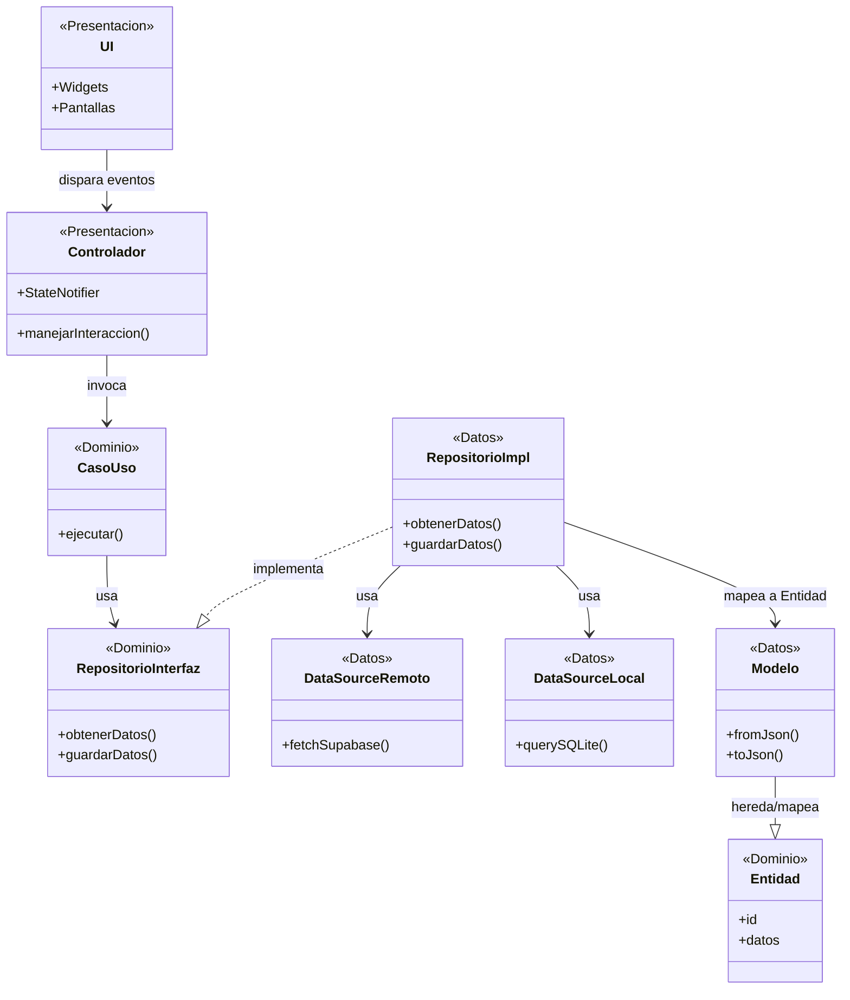

```mermaid
classDiagram
    class UI {
        <<Presentacion>>
        +Widgets
        +Pantallas
    }
    class Controlador {
        <<Presentacion>>
        +StateNotifier
        +manejarInteraccion()
    }
    class CasoUso {
        <<Dominio>>
        +ejecutar()
    }
    class RepositorioInterfaz {
        <<Dominio>>
        <<Interface>>
        +obtenerDatos()
        +guardarDatos()
    }
    class RepositorioImpl {
        <<Datos>>
        +obtenerDatos()
        +guardarDatos()
    }
    class DataSourceRemoto {
        <<Datos>>
        +fetchSupabase()
    }
    class DataSourceLocal {
        <<Datos>>
        +querySQLite()
    }
    class Entidad {
        <<Dominio>>
        +id
        +datos
    }
    class Modelo {
        <<Datos>>
        +fromJson()
        +toJson()
    }

    UI --> Controlador : dispara eventos
    Controlador --> CasoUso : invoca
    CasoUso --> RepositorioInterfaz : usa
    RepositorioImpl ..|> RepositorioInterfaz : implementa
    RepositorioImpl --> DataSourceRemoto : usa
    RepositorioImpl --> DataSourceLocal : usa
    RepositorioImpl --> Modelo : mapea a Entidad
    Modelo --|> Entidad : hereda/mapea
```
