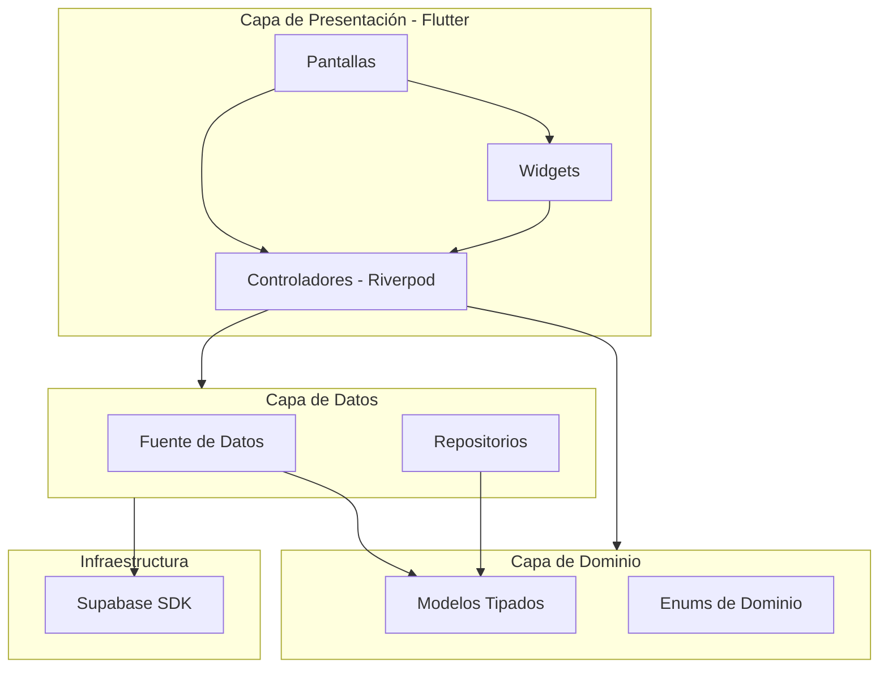

# Arquitectura de BrisWeb

Este documento describe la arquitectura basada en capas del proyecto, siguiendo principios de Clean Architecture.

## Diagrama de Capas (Mermaid)

## Reglas de Arquitectura
1. **Nunca invocar a Supabase directamente desde la UI (Pantallas/Widgets).** 
2. Toda comunicación con Supabase se realiza a través de Fuentes de Datos (Read-only) o Repositorios (Read/Write).
3. Los controladores (`Notifier` de Riverpod) actúan como intermediarios entre la UI y la capa de datos.
4. **Modelos Fuertemente Tipados:** La UI consume clases (ej. `ZarpeModelo`, `CuadreWebModelo`), nunca `Map<String, dynamic>`.
