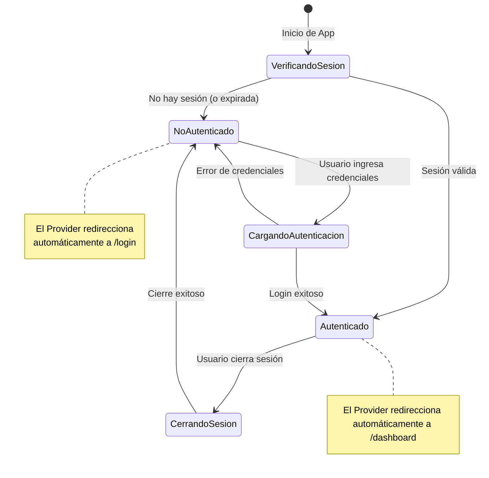

# Flujo de Autenticación

Este documento describe el diagrama de estados para el flujo de autenticación.

## Diagrama de Estados (Mermaid)

```mermaid
stateDiagram-v2
    [*] --> VerificandoSesion: Inicio de App
    
    VerificandoSesion --> NoAutenticado: No hay sesión (o expirada)
    VerificandoSesion --> Autenticado: Sesión válida

    NoAutenticado --> CargandoAutenticacion: Usuario ingresa credenciales
    CargandoAutenticacion --> Autenticado: Login exitoso
    CargandoAutenticacion --> NoAutenticado: Error de credenciales
    
    Autenticado --> CerrandoSesion: Usuario cierra sesión
    CerrandoSesion --> NoAutenticado: Cierre exitoso
    
    note right of Autenticado
        El Provider redirecciona 
        automáticamente a /dashboard
    end note
    
    note right of NoAutenticado
        El Provider redirecciona 
        automáticamente a /login
    end note
```
