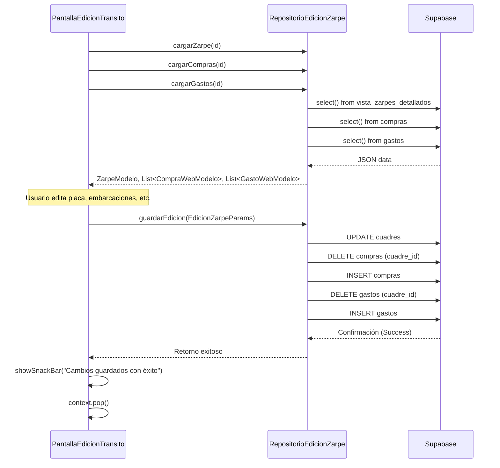

# Flujo de Edición de Zarpe

Este documento describe el diagrama de secuencia para la pantalla de edición de un zarpe.

## Diagrama de Secuencia (Mermaid)

```mermaid
sequenceDiagram
    participant UI as PantallaEdicionTransito
    participant C as RepositorioEdicionZarpe
    participant DB as Supabase

    UI->>C: cargarZarpe(id)
    UI->>C: cargarCompras(id)
    UI->>C: cargarGastos(id)
    
    C->>DB: select() from vista_zarpes_detallados
    C->>DB: select() from compras
    C->>DB: select() from gastos
    
    DB-->>C: JSON data
    C-->>UI: ZarpeModelo, List<CompraWebModelo>, List<GastoWebModelo>
    
    Note over UI: Usuario edita placa, embarcaciones, etc.
    
    UI->>C: guardarEdicion(EdicionZarpeParams)
    
    C->>DB: UPDATE cuadres
    C->>DB: DELETE compras (cuadre_id)
    C->>DB: INSERT compras
    C->>DB: DELETE gastos (cuadre_id)
    C->>DB: INSERT gastos
    
    DB-->>C: Confirmación (Success)
    C-->>UI: Retorno exitoso
    
    UI->>UI: showSnackBar("Cambios guardados con éxito")
    UI->>UI: context.pop()
```
