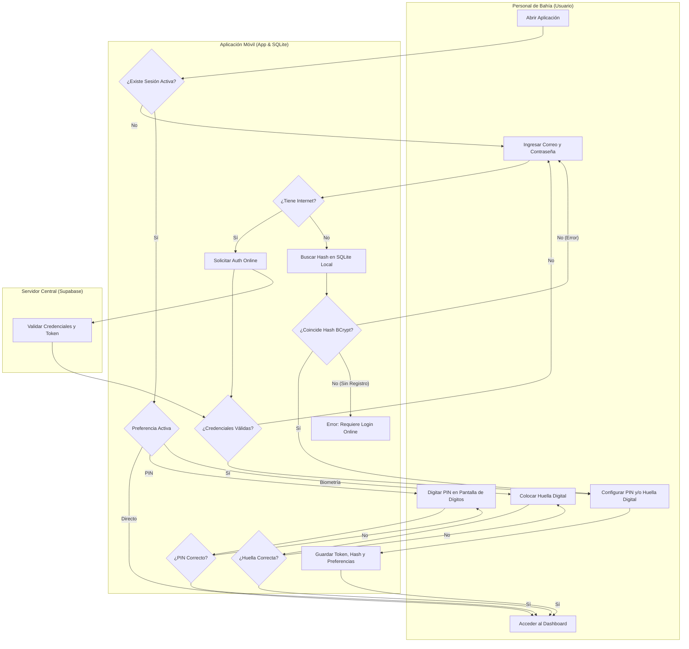

# Flujo 01: Autenticación Offline y Acceso Simplificado (Alta Mar)

Este nodo describe el comportamiento del inicio de sesión de la aplicación móvil de Brismar para el **Personal de Bahía**. Para evitar la fricción de ingresar correo y contraseña constantemente, se implementa un **Flujo Híbrido de Doble Estado**.

## Diagrama de Procesos (Carriles / Swimlanes)

El siguiente diagrama de carriles de procesos detalla cómo la App decide entre el **Login Inicial Completo** (la primera vez o tras cerrar sesión) y el **Acceso Simplificado** (PIN, Huella Digital o Acceso Directo):

## Especificaciones de Seguridad y Usabilidad

1. **Login Inicial Completo:**
   - Obligatorio en el primer inicio o si el usuario cierra su sesión de manera explícita (lo que elimina el token del almacenamiento seguro).
   - Valida la contraseña mediante hashes **BCrypt** de forma local si está offline, o directamente contra la API de **Supabase** si hay internet.
2. **Acceso Simplificado (PIN / Biometría):**
   - Si la sesión local (token) está activa y no ha expirado, el usuario no requiere ingresar su correo y contraseña.
   - El Personal de Bahía puede elegir activar el **PIN de 4 dígitos** o la **Biometría (Huella/Face ID)** desde el primer inicio de sesión exitoso.
   - Si no se define ninguno, la App arranca directamente en el Dashboard (Acceso Directo).
3. **Persistencia:**
   - La información de sesión y preferencias de acceso rápido se almacenan de manera encriptada y persistente en el dispositivo.

---

## 🔗 Enlaces Relacionados

- ¿Por qué decidimos hacerlo así? Revisa `[[03_HISTORIAL_Y_CONTEXTO]]`.
- Reglas de encriptación y base de datos local: `[[01_ARQUITECTURA_Y_REGLAS]]`.
