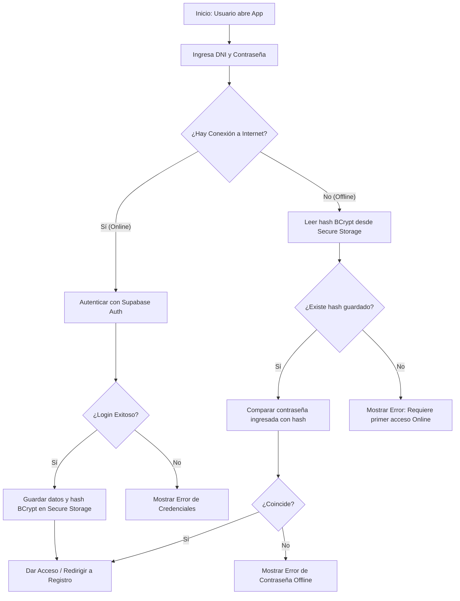

# Flujo 01: Autenticación Offline (Alta Mar)

Este nodo describe cómo la aplicación móvil autentica a un usuario (Pescador o Capitán) cuando no hay conexión a internet (en alta mar).

## Diagrama de Flujo

1. El usuario abre `brismar_app`.
2. Ingresa sus credenciales (DNI / Contraseña).
3. La App revisa el estado de red:
   - **Si HAY internet:** Se autentica directamente con `[[SISTEMA_CENTRAL_SUPABASE]]`. Si el login es exitoso, actualiza las credenciales guardadas en la bóveda local.
   - **Si NO HAY internet:** La App busca el hash de la contraseña en SQLite (SQLCipher).
4. Si el hash local coincide con lo que el usuario escribió, se le da acceso a la aplicación.

## Riesgos Asociados

El proceso depende estrictamente de que el dispositivo físico esté seguro. Ver `[[MAPA_DE_RIESGOS]]` para estrategias en caso de pérdida o robo del teléfono en el barco.

---

## 🔗 Enlaces Relacionados

- ¿Por qué decidimos hacerlo así? Revisa `[[03_HISTORIAL_Y_CONTEXTO]]`.
- Reglas de encriptación y base de datos local: `[[01_ARQUITECTURA_Y_REGLAS]]`.
