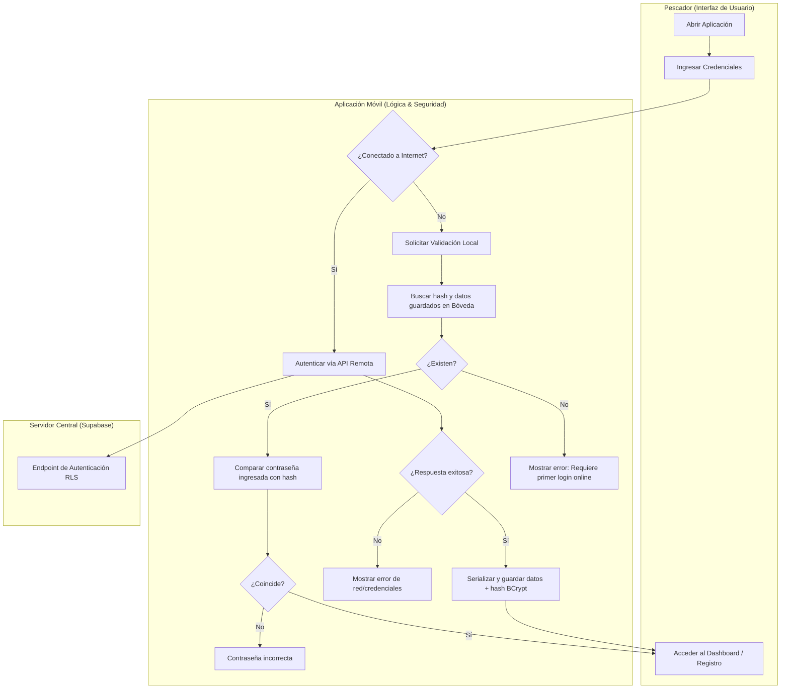

# Flujo 01: Autenticación Offline (Alta Mar)

Este nodo describe cómo la aplicación móvil autentica a un usuario (Pescador o Capitán) cuando no hay conexión a internet (en alta mar).

## Diagrama de Procesos (Carriles / Swimlanes)

El siguiente diagrama detalla la interacción entre el usuario (Pescador), la lógica de la App Móvil y el Servidor Central (Supabase) bajo el estilo de carriles de procesos:

## Riesgos Asociados

El proceso depende estrictamente de que el dispositivo físico esté seguro. Ver `[[MAPA_DE_RIESGOS]]` para estrategias en caso de pérdida o robo del teléfono en el barco.

---

## 🔗 Enlaces Relacionados

- ¿Por qué decidimos hacerlo así? Revisa `[[03_HISTORIAL_Y_CONTEXTO]]`.
- Reglas de encriptación y base de datos local: `[[01_ARQUITECTURA_Y_REGLAS]]`.
