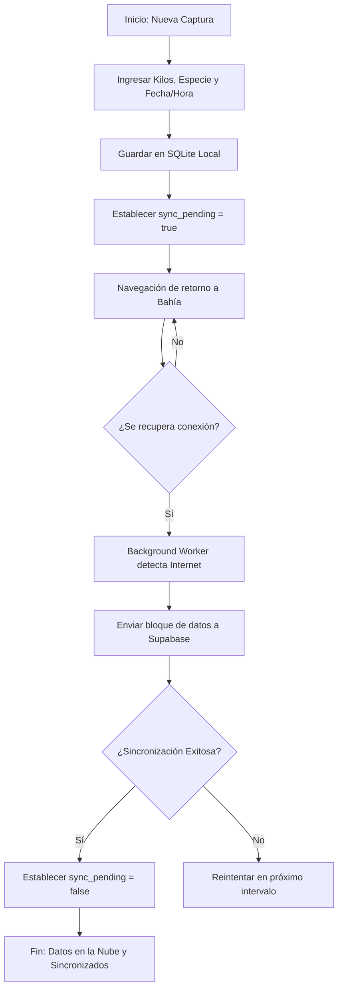

# Flujo 02: Registro de Pesca en Alta Mar

Este es el proceso "Core" de Brismar. Cómo se registra una captura desde la aplicación móvil sin depender de la nube.

## Diagrama de Flujo del Pescador

1. El usuario autenticado (ver `[[FLUJO_01_AUTENTICACION_OFFLINE]]`) entra al módulo de "Nueva Captura".
2. Registra los kilos pescados, la especie y la fecha/hora.
3. Se guarda un registro en la base de datos **SQLite local**. El estado del registro se marca como `sync_pending = true`.
4. El barco navega de regreso a la bahía.
5. El teléfono se conecta al WiFi/4G del puerto.
6. Un proceso en segundo plano (Background Worker) detecta el internet y envía todo el bloque de datos a `[[SISTEMA_CENTRAL_SUPABASE]]`.
7. Si el servidor responde "OK", el registro local se marca como `sync_pending = false` (o se elimina localmente si queremos ahorrar espacio).

## Puntos Críticos

La sincronización debe manejar conflictos si dos usuarios editan el mismo viaje. Revisar `[[MAPA_DE_RIESGOS]]` (Concurrencia).

---

## 🔗 Enlaces Relacionados

- Flujo de revisión por parte del Desarrollador: `[[02_FLUJO_DE_TRABAJO]]`.
