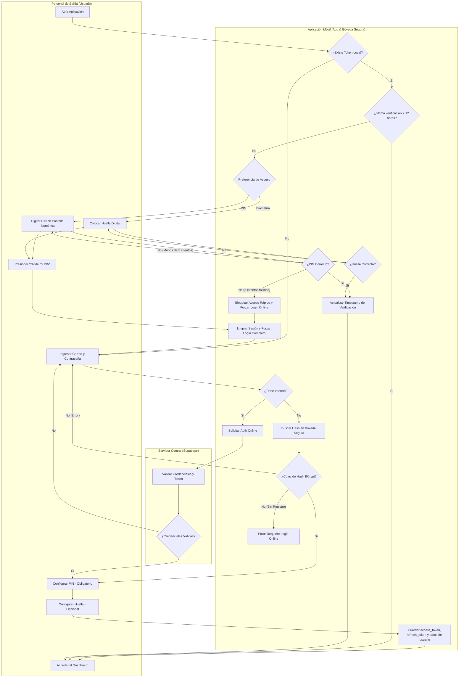
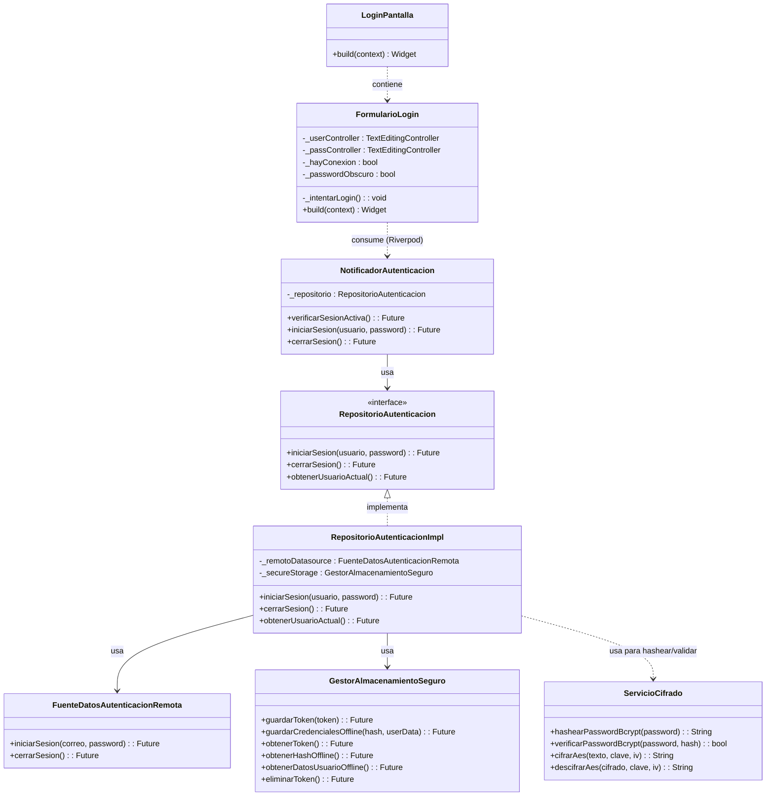

# Flujo 01: Autenticación Completa Online/Offline y Acceso Simplificado

Este documento describe detalladamente la lógica, la experiencia de usuario y las especificaciones técnicas del flujo de inicio de sesión de la aplicación móvil de Brismar para el **Personal de Bahía**.

Para evitar la fricción de ingresar correo y contraseña constantemente, se implementa un **Flujo Híbrido de Doble Estado**.

> [!NOTE]
> **Estado del Proyecto:**
> - **Estado actual:** MVP funcional offline-first.
> - **Pendiente para producción segura:** cifrado SQLCipher completo de la base de datos, implementación de revocación por robo (Flujo 05), uso de tokens reales de sesión de Supabase persistidos de forma robusta, sincronización robusta con manejo de errores y auditoría.

---

## 🗺️ Diagrama de Procesos (Carriles / Swimlanes)

El siguiente diagrama detalla la lógica de decisión y validación de la aplicación:

---

## 🔐 Especificaciones de Seguridad y Usabilidad

### Fase 1: Inicio de Sesión Inicial (Completo)

* **Cuándo ocurre**: La primera vez que se usa la app en el dispositivo, o tras un cierre de sesión manual o bloqueo por intentos fallidos.
* **Proceso**:
  1. El usuario ingresa su **Correo y Contraseña**.
  2. Al presionar "Iniciar Sesión", la app evalúa si cuenta con conexión a internet.
     * > [!IMPORTANT]
     * > **Primer inicio en dispositivo nuevo: obligatorio online.** El primer inicio de sesión de un usuario en un dispositivo nuevo requiere obligatoriamente conexión a internet para validar sus credenciales con Supabase Auth. El inicio offline solo está permitido si el usuario ya inició sesión online previamente en ese dispositivo (para contar con el hash local de validación).
  3. **Con Internet (Online)**: Envía la petición a Supabase, valida las credenciales y descarga el perfil del usuario.
  4. **Sin Internet (Offline)**: Compara los datos ingresados contra el hash **BCrypt** almacenado en la Bóveda Segura del dispositivo. Si coincide, autoriza el acceso local.
  5. **Configuración de Acceso Rápido (PIN Obligatorio)**: Tras el primer login exitoso, la configuración de un **PIN de 4 dígitos es obligatoria**. Sin un PIN configurado, el usuario no puede entrar al módulo principal.
  6. **Biometría Opcional**: La opción de biometría se ofrece únicamente si el dispositivo posee hardware compatible y biometría previamente registrada. Si no está disponible, la app continúa operando exclusivamente con PIN.
  7. **Almacenamiento Seguro**: La app almacena de forma segura en `flutter_secure_storage` los siguientes elementos:
     * La sesión real de Supabase (`access_token` y `refresh_token`). El `user.id` no debe usarse directamente como token de sesión.
     * El hash BCrypt de la contraseña para validación offline.
     * Datos mínimos indispensables del usuario (nombre, rol, id).
     * El timestamp de última verificación exitosa.
     * *(Pendiente Crítico para producción segura)*: La clave maestra para cifrado de base de datos SQLCipher (actualmente SQLite funciona sin cifrado completo de base de datos local).

---

### Fase 2: Acceso Simplificado (Uso Diario)

* **Cuándo ocurre**: Cada vez que el usuario abre la app y ya cuenta con una sesión válida almacenada localmente.
* **Proceso**:
  1. La app pregunta si la última verificación de identidad ocurrió hace **menos de 12 horas**.
  2. **Menos de 12 horas**: El usuario entra directamente al **Dashboard** sin interrupciones.
  3. **Más de 12 horas (Re-verificación)**: Se bloquea la pantalla y se le pide re-verificar su identidad:
     * Por defecto se presenta el teclado numérico del **PIN** (obligatorio).
     * Si activó la biometría (y es soportada), se invoca automáticamente el lector biométrico.
  4. **Límite de Intentos Offline**: Tras **5 intentos fallidos de PIN offline**, la app bloquea el acceso rápido y exige iniciar sesión de forma completa (online) con correo y contraseña. Esto limpia los tokens locales de acceso rápido para proteger el dispositivo. La autodestrucción total de datos locales se delega a la fase de seguridad avanzada y pertenece exclusivamente al **Flujo 05**.
  5. **Actualización de Tiempo**: Una vez que el usuario ingresa su PIN o Huella de forma exitosa, la aplicación **actualiza el timestamp de última verificación**, reiniciando las 12 horas de gracia.

---

### 🛡️ Rutas de Escape y Casos de Recuperación

1. **Olvidé mi PIN**:
   * En la pantalla de ingreso del PIN, se muestra la opción *"Olvidé mi PIN"*.
   * Al presionarla, la aplicación **invalida el acceso rápido actual** y limpia el PIN anterior de la Bóveda Segura.
   * Se solicita al usuario autenticarse ingresando su **Correo y Contraseña** para validar su identidad de forma online (o local si ya tiene caché).
   * Una vez completado el inicio de sesión, se redirige obligatoriamente a configurar un nuevo PIN de 4 dígitos.
2. **Olvidé mi Contraseña**:
   * Dado que en alta mar no se pueden procesar envíos de correo automáticos, el botón de ayuda mostrará información de contacto de soporte local en el muelle de ayuda en tierra para el reestablecimiento de credenciales por el administrador.

---ntacto de soporte local y el muelle de ayuda en tierra para el reestablecimiento de credenciales por el administrador del sistema.

---

## 🏗️ Arquitectura de Clases y Relaciones de Código

Para comprender cómo se plasma el flujo de autenticación anterior a nivel de componentes y clases en el código de Flutter, se presenta el siguiente diagrama estructural:

---

## 🔗 Enlaces Relacionados

* ¿Por qué decidimos hacerlo así? Revisa [[HISTORIAL_Y_CONTEXTO]].
* Reglas de encriptación y base de datos local: [[ARQUITECTURA_Y_REGLAS]].
