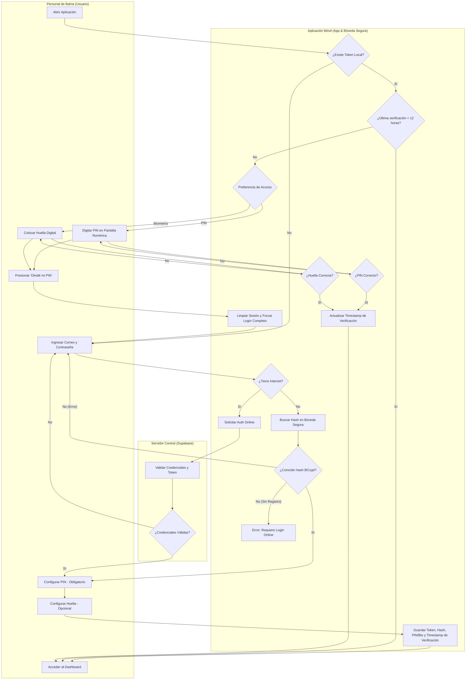
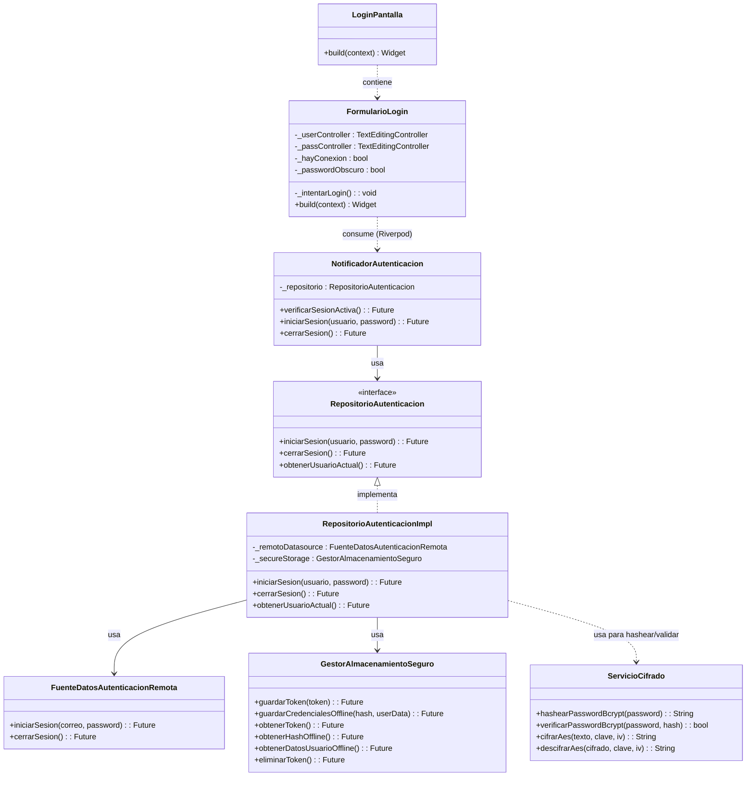

# Flujo 01: Autenticación Completa Online/Offline y Acceso Simplificado

Este documento describe detalladamente la lógica, la experiencia de usuario y las especificaciones técnicas del flujo de inicio de sesión de la aplicación móvil de Brismar para el **Personal de Bahía**.

Para evitar la fricción de ingresar correo y contraseña constantemente, se implementa un **Flujo Híbrido de Doble Estado**.

---

## 🗺️ Diagrama de Procesos (Carriles / Swimlanes)

El siguiente diagrama detalla la lógica de decisión y validación de la aplicación:

---

## 🔐 Especificaciones de Seguridad y Usabilidad

### Fase 1: Inicio de Sesión Inicial (Completo)

* **Cuándo ocurre**: La primera vez que se usa la app en el dispositivo, o tras un cierre de sesión manual que destruye el token local.
* **Proceso**:
  1. El usuario ingresa su **Correo y Contraseña** (es el único proceso de red que no requiere token, ya que es el que lo genera).
  2. Al presionar "Iniciar Sesión", la app evalúa si cuenta con conexión a internet.
  3. **Con Internet (Online)**: Envía la petición a Supabase, valida las credenciales y genera el token de autorización JWT.
  4. **Sin Internet (Offline)**: Compara los datos ingresados contra el hash **BCrypt** almacenado en la **Bóveda Segura** del dispositivo. Si no existe registro previo offline de ese usuario, se rechaza la autenticación indicando que requiere conectarse a internet.
  5. **Configuración de Acceso Rápido**: Tras el login exitoso, se le exige al usuario definir un **PIN numérico (Obligatorio)** y se le ofrece configurar la **Huella Digital (Opcional)**.
  6. **Persistencia**: Se encriptan y guardan en la Bóveda Segura (`Flutter Secure Storage`):
     * El token local de autorización.
     * El hash de contraseña para ingresos offline.
     * Las preferencias de acceso (PIN y huella).
     * El timestamp exacto de la verificación actual.

---

### Fase 2: Acceso Simplificado (Uso Diario)

* **Cuándo ocurre**: Cada vez que el usuario abre la app y ya cuenta con un token almacenado localmente.
* **Proceso**:
  1. La app pregunta si la última verificación de identidad ocurrió hace **menos de 12 horas**.
  2. **Menos de 12 horas**: El usuario entra directamente al **Dashboard** sin interrupciones.
  3. **Más de 12 horas**: Se bloquea la pantalla y se le pide re-verificar su identidad:
     * Por defecto se presenta el teclado numérico del **PIN** (obligatorio).
     * Si activó la biometría, el sistema invoca automáticamente el lector de **Huella Digital**.
  4. **Actualización de Tiempo**: Una vez que el usuario ingresa su PIN o Huella de forma exitosa, la aplicación **actualiza el timestamp de última verificación** en la Bóveda Segura, reiniciando el temporizador de 12 horas de gracia.

---

### 🛡️ Rutas de Escape y Casos de Recuperación

1. **Olvidé mi PIN**:
   * En la pantalla de ingreso del PIN, se muestra la opción *"Olvidé mi PIN"*.
   * Al presionarla, la aplicación **invalida el acceso rápido actual** y limpia el PIN anterior de la Bóveda Segura.
   * Se solicita al usuario autenticarse ingresando su **Correo y Contraseña** para validar su identidad de forma segura.
   * Una vez completado el inicio de sesión con credenciales, la app lo redirige obligatoriamente a la pantalla de **Configurar PIN**, donde registrará su nuevo código de acceso rápido para restablecer el flujo de uso diario.
2. **Olvidé mi Contraseña**:
   * En la pantalla de login con credenciales completas, habrá un botón de ayuda y recuperación. Dado que en alta mar no se pueden procesar envíos de correo automáticos, el botón mostrará información de contacto de soporte local y el muelle de ayuda en tierra para el reestablecimiento de credenciales por el administrador del sistema.

---

## 🏗️ Arquitectura de Clases y Relaciones de Código

Para comprender cómo se plasma el flujo de autenticación anterior a nivel de componentes y clases en el código de Flutter, se presenta el siguiente diagrama estructural:

---

## 🔗 Enlaces Relacionados

* ¿Por qué decidimos hacerlo así? Revisa [[HISTORIAL_Y_CONTEXTO]].
* Reglas de encriptación y base de datos local: [[ARQUITECTURA_Y_REGLAS]].
