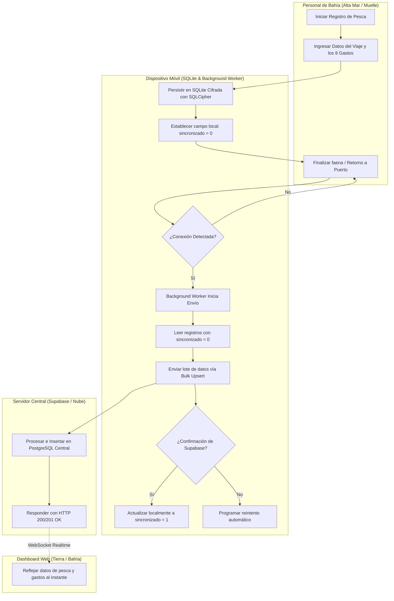

# Flujo 02: Registro de Pesca y Gastos Operativos en Alta Mar

Este documento detalla el proceso central (*Core*) de la aplicación **Brismar Móvil**: cómo se realiza el registro de faenas de pesca, los datos de transporte y los gastos asociados por el Personal de Bahía sin depender de una conexión a internet (enfoque *Offline-First*).

---

## 🗺️ Diagrama de Procesos (Carriles / Swimlanes)

El siguiente diagrama detalla la interacción multi-actor para el registro de pesca y la posterior sincronización con la nube de Supabase y el Dashboard Web:

---

## 📝 Formulario Completo de Captura y Gastos

Para garantizar que el cierre de caja y los reportes financieros en tierra sean 100% exactos, el Personal de Bahía debe rellenar los siguientes campos en la aplicación móvil antes de guardar:

### 🚢 Datos Operativos e Identificación

* **Nombre de la Embarcación (`nombre_embarcacion`):** Nombre de la lancha o barco pesquero (Obligatorio).
* **Producto (`producto`):** Especie marina capturada (ej: pota, jurel, caballa) (Obligatorio).
* **Placa del Vehículo (`placa_carro`):** Identificación del camión transportista en tierra (Opcional).
* **Muelle de Inicio (`muelle_inicio`):** Puerto de zarpe/desembarque (Obligatorio).
* **Kilos (`kilos`):** Peso neto total de la pesca (Obligatorio).
* **Precio por Kilo (`precio_por_kilo`):** Valor unitario pactado para el producto (Obligatorio).
* **Fecha (`fecha`):** Fecha del registro (Autogenerada en formato `YYYY-MM-DD`).
* **Hora (`hora`):** Hora del registro (Autogenerada en formato `HH:MM:SS`).

### 💸 Desglose de Gastos Operativos (8 Conceptos)

Para cada viaje de pesca, se registran individualmente 8 montos numéricos (por defecto `0.00`):

1. **Gasto de Facturación (`gasto_facturacion`):** Costo por emisión de guías e impuestos de desembarque.
2. **Gasto de Personal (`gasto_personal`):** Pago a cargadores y pesadores del muelle.
3. **Gasto de Apoyo (`gasto_apoyo`):** Propinas y apoyo logístico informal de bahía.
4. **Gasto de Agua (`gasto_agua`):** Costo de agua potable para limpieza e hidratación de la tripulación.
5. **Gasto de Clorox (`gasto_clorox`):** Insumos de limpieza y desinfección sanitaria de las bodegas.
6. **Gasto de Flete (`gasto_flete`):** Costo del transporte terrestre del producto.
7. **Gasto de Hielo (`gasto_hielo`):** Hielo triturado para la conservación de la pesca.
8. **Gasto de Otros (`gasto_otros`):** Gastos de imprevistos o conceptos menores no categorizados.

---

## 🛡️ Persistencia Local e Idempotencia (Concurrencia)

### 1. Clave Primaria UUID v4

Cada registro creado en la aplicación móvil genera automáticamente un **`id` único de tipo UUID v4** en el lado del cliente (ej: `550e8400-e29b-41d4-a716-446655440000`).

### 2. Estrategia contra Conflictos de Concurrencia

Dado que varios dispositivos pueden reportar registros al mismo tiempo al volver a puerto:

* **Idempotencia Absoluta:** Al subir los datos a Supabase se utiliza la instrucción **`upsert`** configurando el campo `id` como clave de resolución. Si un registro ya fue recibido (por ejemplo, debido a una desconexión en la confirmación de red), Supabase simplemente actualizará los datos en lugar de crear un duplicado.
* **Evitar Solapamientos:** Al no depender de auto-incrementales del servidor para la clave primaria, es imposible que el registro offline de un pescador sobreescriba o bloquee el registro de otro pescador.

---

## 🔗 Enlaces Relacionados

* Capa de persistencia local en Flutter: [fuente_datos_registro_local.dart](file:///home/jhonataningesis/Documentos/Brismar/BRISMAR_APP/brismar_app/lib/modulos/registro/datos/fuentes_datos/fuente_datos_registro_local.dart).
* Proceso técnico detallado de subida en lote: [[FLUJO_04_SINCRONIZACION_FONDO]].
* Esquema único de base de datos en Supabase (compartido con la Web): [registro_embarcaciones en Supabase](file:///home/jhonataningesis/Documentos/Brismar/BRISMAR_APP/supabase/migrations/).
