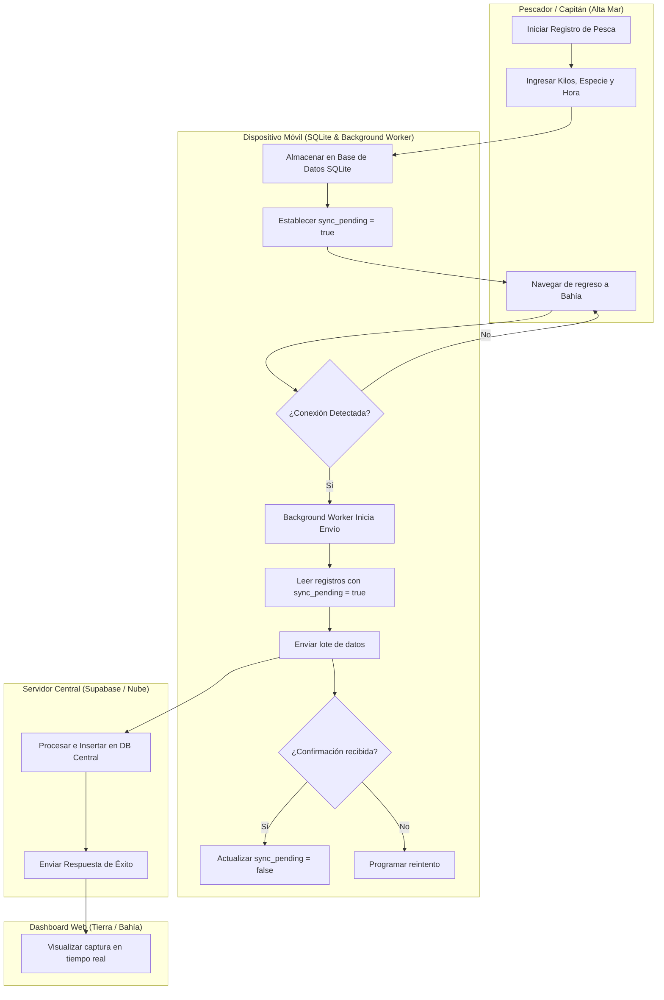

# Flujo 02: Registro de Pesca en Alta Mar

Este es el proceso "Core" de Brismar. Cómo se registra una captura desde la aplicación móvil sin depender de la nube.

## Diagrama de Procesos (Carriles / Swimlanes)

El siguiente diagrama detalla la interacción multi-actor para el registro de pesca y la posterior sincronización con la central y la web:

## Puntos Críticos

La sincronización debe manejar conflictos si dos usuarios editan el mismo viaje. Revisar `[[MAPA_DE_RIESGOS]]` (Concurrencia).

---

## 🔗 Enlaces Relacionados

- Flujo de revisión por parte del Desarrollador: [[FLUJO_DE_TRABAJO]].
