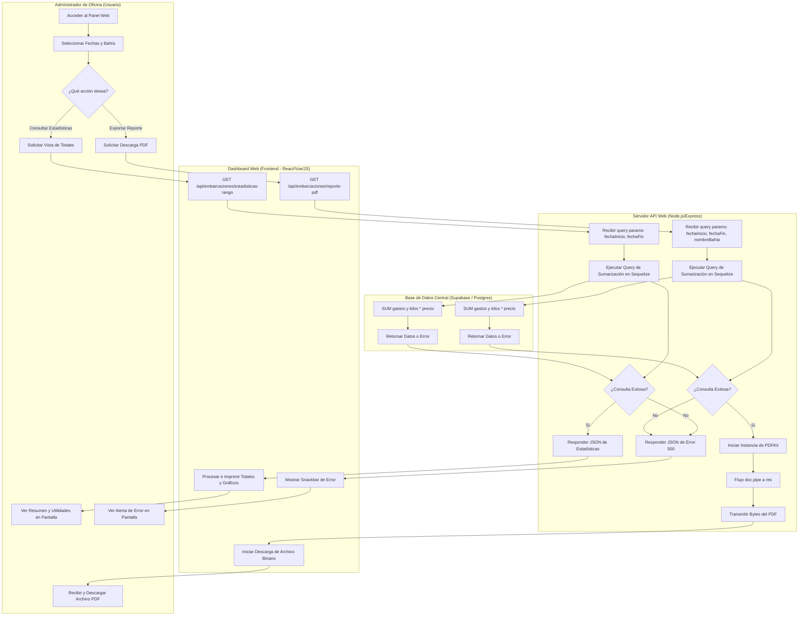
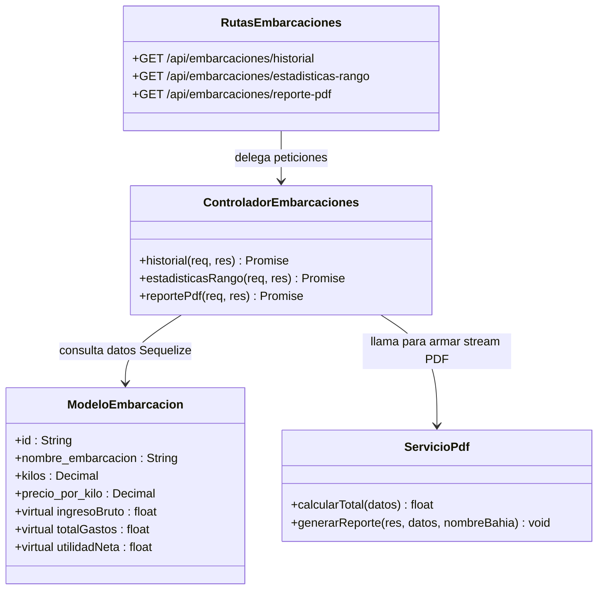

# Flujo 03: Generación de Reportes Financieros y Cierre de Caja en Tierra (Web)

Este documento describe el flujo operativo y de sistema para la visualización de estadísticas, conciliación financiera y descarga de reportes detallados en formato PDF desde el Dashboard administrativo en tierra.

---

## 🗺️ Diagrama de Procesos (Carriles / Swimlanes)

El siguiente diagrama detalla el flujo de consulta, procesamiento de datos y streaming de reportes en la plataforma web:

---

## 📊 Especificaciones de la Lógica y Operación del Sistema

### 1. Entrada de Parámetros (Filtros de Búsqueda)
El administrador del sistema puede filtrar el consolidado de las operaciones de pesca a través de tres parámetros opcionales enviados como query params en la URL:
*   `fechaInicio` (Por defecto: `'2026-04-28'`)
*   `fechaFin` (Por defecto: `'2026-05-05'`)
*   `nombreBahia` (Por defecto: `'Bahía'`) (Bahía responsable a cargo de las operaciones en los muelles).

### 2. Consulta y Consolidación Financiera (Cierre de Caja)
Al recibir la petición, el servidor Node.js/Express ejecuta una consulta SQL agregada utilizando Sequelize ORM sobre la tabla `registro_embarcaciones` para totalizar ingresos y gastos del periodo:

*   **Ingreso Bruto:** Calculado mediante la suma ponderada del producto:
    $$\text{Ingreso Bruto} = \sum (\text{kilos} \times \text{precio\_por\_kilo})$$
*   **Total de Gastos:** Suma agregada de los 8 conceptos de gastos registrados por el personal móvil:
    $$\text{Total Gastos} = \sum (\text{gasto\_hielo} + \text{gasto\_personal} + \text{gasto\_flete} + \text{gasto\_agua} + \text{gasto\_clorox} + \text{gasto\_facturacion} + \text{gasto\_apoyo} + \text{gasto\_otros})$$
*   **Utilidad Neta (Ganancia Real):**
    $$\text{Utilidad Neta} = \text{Ingreso Bruto} - \text{Total Gastos}$$

---

## 📄 Formateo del Reporte PDF (Motor PDFKit)
Cuando el administrador solicita la descarga del reporte, el backend ejecuta el servicio de PDF en [servicio_pdf.js](file:///c:/BRISMAR_APP/brismar_web/src/modulos/embarcaciones/servicio_pdf.js) utilizando la biblioteca `pdfkit`:
1.  **Instanciación y Flujo de Stream:** Se crea un nuevo `PDFDocument` y se enlaza (pipe) directamente al flujo de respuesta HTTP (`res`). Esto permite descargar el archivo al vuelo sin guardarlo físicamente en el disco duro del servidor, ahorrando espacio en disco.
2.  **Cabecera de Negocios:** Dibuja el logotipo legal, la razón social "NEGOCIOS BRISMAR S.R.L.", el RUC corporativo y el nombre del Bahía Responsable de las operaciones en el periodo consultado.
3.  **Tabla de Desglose de Gastos:** Desglosa los totales acumulados por concepto:
    *   Hielo
    *   Personal (cargadores, pesadores)
    *   Flete
    *   Agua/Clorox
    *   Otros
4.  **Resumen Financiero:** Imprime el total de gastos acumulados, el ingreso bruto total y la **Utilidad Neta destacada en color verde** (`doc.fillColor('green')`) para facilitar la visualización inmediata de los números verdes y ganancias reales del negocio en tierra.

---

## 🏗️ Arquitectura de Componentes Web Asociados

A nivel del código del servidor de Node.js, las clases y archivos que participan en este flujo son:

---

## 🔗 Enlaces Relacionados

*   Para ver cómo se originan los datos consolidados en alta mar: [[FLUJO_02_REGISTRO_PESCA]].
*   Estructura física de la base de datos compartida: [[SISTEMA_CENTRAL_SUPABASE]].
*   Controladores de Rutas en la Web: [rutas_embarcaciones.js](file:///c:/BRISMAR_APP/brismar_web/src/modulos/embarcaciones/rutas_embarcaciones.js) y [controlador_embarcaciones.js](file:///c:/BRISMAR_APP/brismar_web/src/modulos/embarcaciones/controlador_embarcaciones.js).
