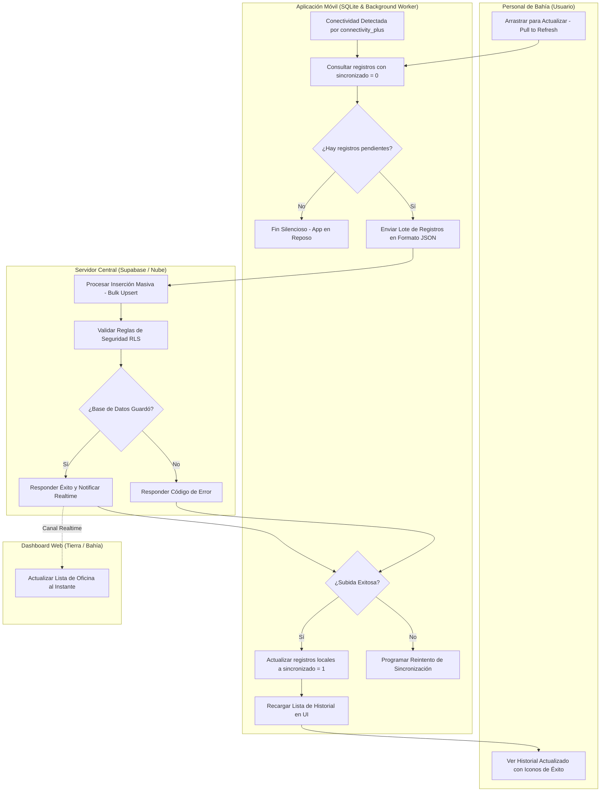
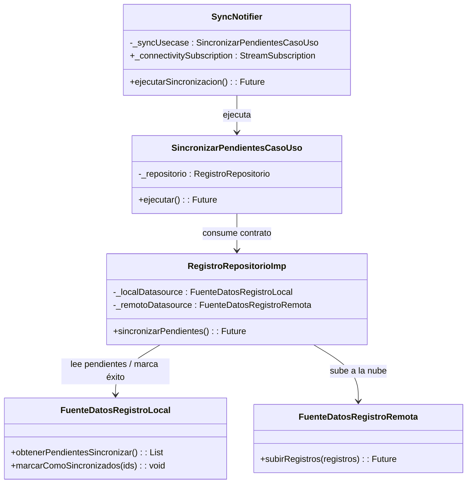

# Flujo 04: Sincronización Automática en Segundo Plano (Background Sync)

Este documento detalla la lógica de sincronización asíncrona en lotes (Bulk Sync) que se ejecuta cuando el dispositivo móvil del **Personal de Bahía** recupera conectividad a internet tras haber trabajado en modo offline.

---

## 🗺️ Diagrama de Procesos (Carriles / Swimlanes)

El siguiente diagrama de carriles ilustra la activación del Background Worker, la lectura local, la subida en lote y la actualización en tiempo real en la web:



---

## 📊 Especificación de la Sincronización en Lote

### 1. Disparadores del Proceso (Triggers)
El flujo de sincronización puede ser despertado por dos eventos mutuamente excluyentes:
1.  **Gatillo Automático (Sistema):** El listener de la librería `connectivity_plus` detecta una transición de red (de sin conexión a conexión WIFI, Móvil o Ethernet) y despierta al servicio `SyncNotifier` en [registro_controlador.dart](file:///c:/BRISMAR_APP/brismar_app/lib/modulos/registro/presentacion/controladores/registro_controlador.dart).
2.  **Gatillo Manual (Usuario):** El operario arrastra la lista de historial hacia abajo (`RefreshIndicator`) en la pantalla de la app, forzando la ejecución del método `ejecutarSincronizacion()`.

### 2. Extracción de Datos en Lote
La app móvil consulta la base de datos local SQLite utilizando el método `obtenerPendientesSincronizar()` en [fuente_datos_registro_local.dart](file:///c:/BRISMAR_APP/brismar_app/lib/modulos/registro/datos/fuentes_datos/fuente_datos_registro_local.dart):
```sql
SELECT * FROM registro_embarcaciones WHERE sincronizado = 0;
```
*   **Si la lista está vacía:** El flujo termina inmediatamente sin consumir datos móviles ni batería.
*   **Si contiene registros:** Convierte cada registro a JSON y los agrupa en un lote de datos.

### 3. Subida Masiva y Upsert (Nube)
El lote se transmite a Supabase mediante la función `subirRegistros()` en [fuente_datos_registro_remota.dart](file:///c:/BRISMAR_APP/brismar_app/lib/modulos/registro/datos/fuentes_datos/fuente_datos_registro_remota.dart).
*   **Estrategia de Idempotencia:** Se utiliza un **`upsert`** basado en la clave primaria (`id` UUID v4). Si un registro ya se había subido parcialmente en un intento anterior fallido, Supabase simplemente actualiza sus campos en lugar de crear un duplicado, evitando la corrupción de datos y resolviendo problemas de reintentos.

### 4. Actualización del Estado Local
Al recibir la confirmación exitosa de Supabase:
*   Se ejecuta `marcarComoSincronizados(ids)` en SQLite.
*   Se cambia el flag local de `sincronizado` a `1` para liberar la cola de pendientes.
*   La interfaz gráfica refresca los iconos de estado (el icono de reloj naranja "pendiente" cambia a un check verde "sincronizado").

---

## 🏗️ Arquitectura de Clases y Métodos Asociados

El proceso asíncrono y reactivo se integra en la arquitectura limpia móvil mediante los siguientes componentes:



---

## 🔗 Enlaces Relacionados

*   Creación inicial de un registro en modo local: [[FLUJO_02_REGISTRO_PESCA]].
*   Soporte técnico de persistencia SQLite: [gestor_base_datos.dart](file:///c:/BRISMAR_APP/brismar_app/lib/nucleo/base_datos/gestor_base_datos.dart) y [fuente_datos_registro_local.dart](file:///c:/BRISMAR_APP/brismar_app/lib/modulos/registro/datos/fuentes_datos/fuente_datos_registro_local.dart).
*   Controlador de sincronización móvil: [registro_controlador.dart](file:///c:/BRISMAR_APP/brismar_app/lib/modulos/registro/presentacion/controladores/registro_controlador.dart).
