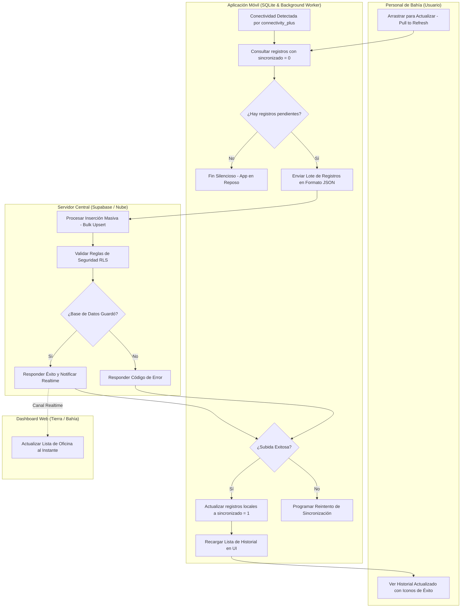
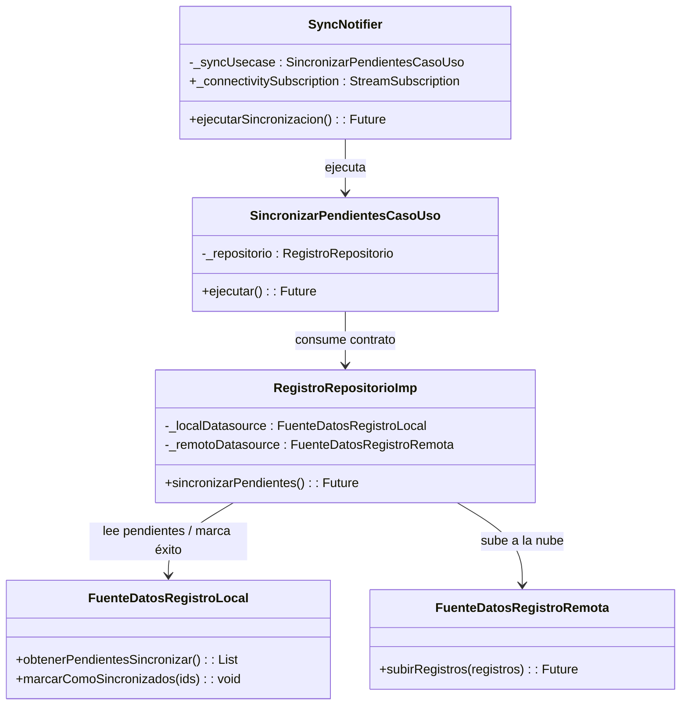

# Flujo 04: Sincronización Automática en Segundo Plano (Background Sync)

Este documento detalla la lógica de sincronización asíncrona en lotes (Bulk Sync) que se ejecuta cuando el dispositivo móvil del **Personal de Bahía** recupera conectividad a internet tras haber trabajado en modo offline.

---

## 🗺️ Diagrama de Procesos (Carriles / Swimlanes)

El siguiente diagrama de carriles ilustra la activación del Background Worker, la lectura local, la subida en lote y la actualización en tiempo real en la web:



---

## 📊 Especificación de la Sincronización en Lote

### 1. Disparadores del Proceso (Triggers)

El flujo de sincronización puede ser despertado por dos eventos mutuamente excluyentes:

1. **Gatillo Automático (Sistema):** El listener de la librería `connectivity_plus` detecta una transición de red (de sin conexión a conexión WIFI, Móvil o Ethernet) y despierta al servicio `SyncNotifier` en [registro_controlador.dart](file:///home/jhonataningesis/Documentos/Brismar/BRISMAR_APP/brismar_app/lib/modulos/registro/presentacion/controladores/registro_controlador.dart).
2. **Gatillo Manual (Usuario):** El operario arrastra la lista de historial hacia abajo (`RefreshIndicator`) en la pantalla de la app, forzando la ejecución del método `ejecutarSincronizacion()`.

### 2. Extracción Paginada y Límites de Lote (Batch Limits)

Para evitar sobrecargar la red móvil inestable en la bahía o generar timeouts con cargas de datos excesivas, la extracción local se realiza de forma paginada:

```sql
SELECT * FROM registro_embarcaciones WHERE sincronizado = 0 LIMIT 20;
```

* **Límite de Lote:** Se extrae un máximo de **20 registros por lote**.
* **Procesamiento Secuencial:** Si existen más de 20 registros pendientes, la app procesa el primer lote, lo sube exitosamente y de inmediato ejecuta un nuevo ciclo para el siguiente lote, hasta vaciar la cola de pendientes.
* **Cola Vacía:** Si la consulta retorna cero registros, el flujo finaliza de forma silenciosa para conservar batería y datos.

### 3. Subida Masiva y Upsert (Nube)

El lote de 20 registros se serializa a JSON y se transmite a Supabase mediante la función `subirRegistros()` en [fuente_datos_registro_remota.dart](file:///home/jhonataningesis/Documentos/Brismar/BRISMAR_APP/brismar_app/lib/modulos/registro/datos/fuentes_datos/fuente_datos_registro_remota.dart).

* **Estrategia de Idempotencia:** Se realiza un **`upsert`** en Supabase usando el `id` (UUID v4) como clave. Si un registro ya existe en el servidor debido a un intento de subida previo que no recibió confirmación, se sobrescribe en lugar de duplicarse, evitando inconsistencias financieras.

### 4. Control de Errores Individuales y Marcación Local

Al finalizar la petición a Supabase:

* **Sincronización Exitosa:** Para los registros subidos correctamente, se ejecuta `marcarComoSincronizados(ids)` en SQLite, cambiando el flag `sincronizado` a `1`. La UI actualiza el icono de reloj naranja por un check verde.
* **Aislamiento de Registros Corruptos (Errores RLS o Validación):** Si un registro específico es rechazado por el servidor debido a fallos de validación o políticas RLS:
  * Se marca en SQLite local como `sincronizado = -1` (Error de Sincronización) en lugar de dejarlo en `0`.
  * Esto evita que el registro corrupto bloquee de forma infinita la sincronización del resto de la cola de pendientes.
  * El registro con error se muestra en la UI con una alerta roja para que el operario lo revise o reporte a soporte.
* **Reintento de Red:** Si la subida falla por desconexión general de red, no se altera el flag local y se programa un reintento automático en el próximo cambio de conectividad.

---

## 🏗️ Arquitectura de Clases y Métodos Asociados



---

## 🔗 Enlaces Relacionados

* Creación inicial de un registro en modo local: [[FLUJO_02_REGISTRO_PESCA]].
* Soporte técnico de persistencia SQLite: [gestor_base_datos.dart](file:///home/jhonataningesis/Documentos/Brismar/BRISMAR_APP/brismar_app/lib/nucleo/base_datos/gestor_base_datos.dart) y [fuente_datos_registro_local.dart](file:///home/jhonataningesis/Documentos/Brismar/BRISMAR_APP/brismar_app/lib/modulos/registro/datos/fuentes_datos/fuente_datos_registro_local.dart).
* Controlador de sincronización móvil: [registro_controlador.dart](file:///home/jhonataningesis/Documentos/Brismar/BRISMAR_APP/brismar_app/lib/modulos/registro/presentacion/controladores/registro_controlador.dart).
