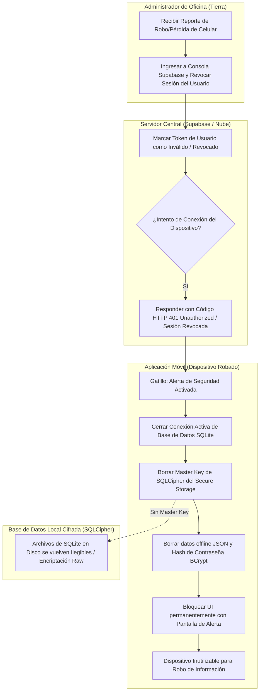
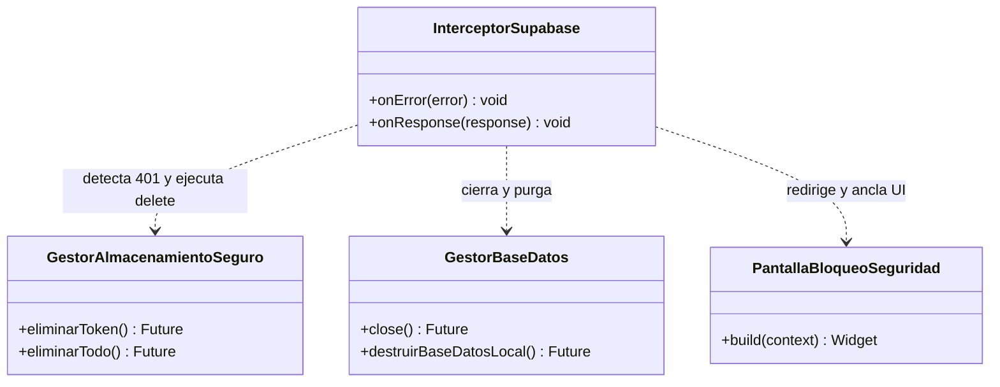

# Flujo 05: Protocolo de Revocación y Autodestrucción por Robo del Dispositivo

Este documento detalla el protocolo de seguridad y contingencia técnica que se ejecuta cuando un dispositivo móvil con la aplicación de Brismar es reportado como robado o extraviado en la bahía de operaciones.

---

## 🗺️ Diagrama de Procesos (Carriles / Swimlanes)

El siguiente diagrama ilustra la cadena de eventos desde el reporte del robo en tierra hasta el bloqueo absoluto y borrado de la base de datos cifrada en el celular:

---

## 📊 Especificación Técnica del Protocolo de Seguridad

### 1. Revocación en el Servidor (Supabase)

Cuando el administrador en tierra confirma el robo del dispositivo, ejecuta la desactivación desde la consola central:

* Invalida el JWT activo del usuario.
* En la base de datos, marca la columna `activo = false` en la tabla `usuarios` (bloqueando de inmediato cualquier validación offline en futuros accesos).
* Cualquier llamada a la API (sincronización o consulta) que realice la app usando ese token recibirá inmediatamente un error HTTP **`401 Unauthorized`** con el mensaje de sesión inválida.

### 2. Autodestrucción Local de Datos (Device Wipe - Online)

En el momento en que la aplicación móvil recibe el código `401` o el flag de usuario bloqueado:

1. **Cierre de SQLCipher:** Cierra inmediatamente la conexión activa a la base de datos local SQLite utilizando `GestorBaseDatos.instance.close()` para evitar lecturas en memoria.
2. **Destrucción de Claves de Cifrado:** Llama al `secureStorage.deleteAll()` ([gestor_almacenamiento_seguro.dart](file:///home/jhonataningesis/Documentos/Brismar/BRISMAR_APP/brismar_app/lib/nucleo/seguridad/gestor_almacenamiento_seguro.dart)), borrando:
   * La clave maestra de encriptación de SQLCipher.
   * El token JWT y refresh token de Supabase.
   * El hash de contraseña local (`offline_password_hash`).
   * Los datos del usuario offline (`offline_user_data`).
3. **Inutilización Física de la BD:** Sin la clave maestra almacenada en el Secure Storage del hardware, el archivo `.db` en el almacenamiento del dispositivo se convierte en ruido binario aleatorio inservible. Ningún software de extracción forense de datos podrá leer los kilos de pesca o gastos históricos del viaje.
4. **Bloqueo de UI (Bricking):** La aplicación reemplaza la navegación y muestra en pantalla de forma permanente una vista de color rojo con el mensaje:
   > **"DISPOSITIVO BLOQUEADO POR SEGURIDAD. Contacte al administrador en el muelle."**
   * Esta pantalla bloquea el botón físico de volver atrás y no se quita incluso si el teléfono se reinicia o se abre offline.

### 3. Protocolo de Autodestrucción Offline (Defensa contra Fuerza Bruta)

Si el dispositivo robado es desconectado de internet (modo avión) por el ladrón para evitar la revocación remota:

* **Límite de Intentos Offline:** La aplicación móvil mantiene un contador local persistente en el Secure Storage que registra los intentos fallidos de PIN.
* **Auto-Detonación:** Si el usuario ingresa un PIN incorrecto **5 veces consecutivas sin conexión a internet**, la aplicación móvil activa de forma autónoma el mismo protocolo de autodestrucción local descritos anteriormente (Fase 2: borrado total de la Bóveda Segura de hardware, cierre de base de datos SQLite y bloqueo físico de la UI).
* **Falso Positivo:** Si el dispositivo fue bloqueado por error del usuario legítimo, al eliminarse la llave de cifrado maestro local de SQLite, la base de datos no podrá recuperarse directamente. Para reactivar el celular, el administrador en tierra deberá habilitar nuevamente al usuario en Supabase, y el operario deberá realizar un inicio de sesión completo (online) con su correo y contraseña para regenerar una nueva base de datos local y clave de cifrado.

---

## 🏗️ Arquitectura de Cierre de Seguridad en Código

---

## 🔗 Enlaces Relacionados

* Cifrado de Base de Datos y Bóveda Segura: [[ARQUITECTURA_Y_REGLAS]].
* Manejo de variables de entorno y credenciales: [[FLUJO_DE_TRABAJO]].
* Gestores de seguridad locales: [gestor_almacenamiento_seguro.dart](file:///home/jhonataningesis/Documentos/Brismar/BRISMAR_APP/brismar_app/lib/nucleo/seguridad/gestor_almacenamiento_seguro.dart) y [servicio_cifrado.dart](file:///home/jhonataningesis/Documentos/Brismar/BRISMAR_APP/brismar_app/lib/nucleo/seguridad/servicio_cifrado.dart).
