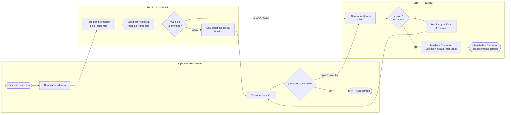

# Flujo 06: Gestión de Incidencias TI

Este documento describe el proceso interno de BRISMAR para detectar, clasificar, escalar y resolver incidencias tecnológicas que afecten la operación de la aplicación móvil, el dashboard web, la sincronización offline-first o cualquier componente de infraestructura del sistema.

---

## 🗺️ Diagrama de Procesos (Carriles / Swimlanes)

El proceso opera en **3 niveles de atención**. El cierre siempre es validado por quien reportó la incidencia (Operario). Si la capacidad interna es insuficiente, el proceso concluye formalmente al escalar al proveedor externo.



---

## 🔍 Criterios de Clasificación de Prioridad

El Técnico TI evalúa dos dimensiones antes de asignar la prioridad:

| Dimensión | Pregunta clave | Escala |
| --- | --- | --- |
| **Impacto** | ¿Cuántos usuarios / operaciones están afectadas? | Bajo (1 usuario) / Medio (un turno) / Alto (operación completa) |
| **Urgencia** | ¿Puede la operación continuar sin esto? | Puede esperar / Degradada / Paralizada |

### Tabla de Prioridad Resultante

| Impacto \ Urgencia | Puede esperar | Degradada | Paralizada |
| --- | --- | --- | --- |
| **1 usuario** | 🟢 BAJA | 🟢 BAJA | 🟡 MEDIA |
| **Un turno** | 🟢 BAJA | 🟡 MEDIA | 🔴 ALTA |
| **Operación completa** | 🟡 MEDIA | 🔴 ALTA | 🔴 ALTA |

---

## 📋 Definición de Niveles de Atención

### Nivel 1 — Técnico TI

- **Alcance**: Incidencias **BAJA** que pueden resolverse sin interrumpir al Jefe TI.
- **Ejemplos**: App no sincroniza en un dispositivo, reinstalación requerida, configuración de PIN, error de validación de formulario.
- **SLA objetivo**: Resolución en **menos de 2 horas**.
- **Resultado**: Notifica al Operario para confirmación. Si el Operario rechaza, el Jefe TI retoma.

### Nivel 2 — Jefe TI

- **Alcance**: Incidencias **MEDIA o ALTA** o cualquier rechazo del Operario.
- **Ejemplos**: Fallo de sincronización masiva, error de autenticación en múltiples dispositivos, corrupción de SQLite, pérdida de conectividad Supabase.
- **SLA objetivo**: Atención en **menos de 30 minutos**, resolución en **menos de 4 horas**.
- **Decisión clave**: Evalúa si puede resolverlo internamente (`Sí → Resolver y Notificar`) o si requiere soporte externo (`No → Escalar a Proveedor`).

### Nivel 3 — Proveedor Externo *(Fuera del proceso interno)*

- **Alcance**: Fallas de infraestructura de Supabase, problemas de certificados SSL, fallas del servidor Node.js en producción, incidencias de red del ISP.
- **Cómo se activa**: El Jefe TI escala formalmente con ticket documentado.
- **Proceso interno**: Concluye al escalar. El seguimiento externo queda en manos del Jefe TI.

---

## 🛡️ Política de Loop de Rechazo

Cuando el Operario **no confirma** la solución:

```text
Operario rechaza → Jefe TI (N2) retoma y re-evalúa
```

**Justificación**: Si el Técnico N1 ya intentó resolver y no funcionó, corresponde a un nivel superior re-analizar el diagnóstico. Esto aplica incluso para incidencias que iniciaron como BAJA — el rechazo implica que el alcance fue mal evaluado.

> [!NOTE]
> No existe límite de iteraciones en el loop. Sin embargo, si tras **2 rechazos consecutivos** el Jefe TI no logra resolver, se recomienda activar el path de escalamiento (→ Escalar a Proveedor Externo).

---

## 📎 Relación con Otros Flujos del Sistema

| Incidencia típica | Flujo afectado | Acción TI recomendada |
| --- | --- | --- |
| App no autentica en ningún dispositivo | [[FLUJO_01_AUTENTICACION]] | Verificar Supabase Auth, tokens JWT, RLS |
| Registros de pesca no sincronizan | [[FLUJO_02_REGISTRO_PESCA]] | Revisar worker de fondo, conectividad, tabla SQLite |
| Liquidaciones PDF no se generan | [[FLUJO_03_REPORTE_FINANCIERO]] | Revisar servidor Node.js/Express en tierra |
| Background sync en loop infinito | [[FLUJO_04_SINCRONIZACION_FONDO]] | Revisar lógica de reintentos y flag `sincronizado` |
| Dispositivo perdido / robado | [[FLUJO_05_REVOCACION_ROBO]] | Revocar en Supabase Console inmediatamente |

---

## 🗂️ Diagrama BPMN Asociado

El diagrama BPMN 2.0 completo (apto para Bizagi Modeler, bpmn.io y Camunda) está disponible en:

[gestion_incidencias_TI.bpmn](file:///home/jhonataningesis/Documentos/Brismar/BRISMAR_APP/docs/brismar_brain/diagramas_TI/gestion_incidencias_TI.bpmn)

**Versión actual**: 3.0 — Layout ortogonal limpio, 3 carriles, sin carril de Proveedor Externo.

---

## 🔗 Referencias

- Diagrama TI: [[diagramas_TI/gestion_incidencias_TI]]
- Stack técnico: Supabase + Flutter + SQLite (SQLCipher) + Node.js/Express
- Documentación de arquitectura: [[ARQUITECTURA_Y_REGLAS]]
