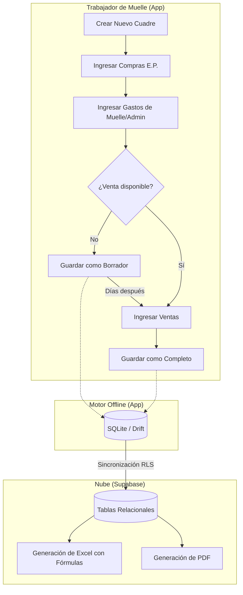

# FLUJO 07: CUADRES JERÁRQUICOS (MODELO ASIMÉTRICO)

Este documento registra el análisis definitivo, las reglas de negocio y las decisiones arquitectónicas para el módulo de "Cuadres" de Bris Mar, basándose en la plantilla Excel protegida y los procesos manuales de campo reales.

## 1. Naturaleza del Flujo: El Modelo Asimétrico
El descubrimiento más crítico es que **el flujo de datos está roto temporalmente**.
- **Paso 1 (Zarpe):** Se ingresan las compras (Múltiples Embarcaciones E.P.).
- **Paso 2 (Llegada):** Se ingresan los gastos del muelle operativos (Fijos y Variables).
- **Paso 3 (Días Después):** Llega la información de la venta desde el comprador.

**Regla de Negocio:** La aplicación debe soportar **Borradores (Drafts)**. Si falta la venta, el cuadre se guarda y sincroniza como "Borrador" para evitar errores de división por cero (`#DIV/0!`) en los reportes financieros.

---

## 2. Diagrama de Proceso (BPMN)

---

## 3. Estructura de la Plantilla Excel Base
La generación del Excel en la app debe replicar exactamente 4 hojas con protección de celdas (`contraseña: brismar2024`):

1. **CUADRE (Hoja Principal):**
   - Compras E.P.: Hasta 5 filas (fecha, embarcación, producto, kilos, precio).
   - Ventas: Hasta 4 filas.
   - Gastos Muelle: Separados en cantidad y precio unitario (Personal, Hielo, Flete, Reinhielada).
   - Gastos Admin: Facturación (0.1%), Gastos Financieros (escalonado), Impuesto Renta (3%).
   - Utilidades: Cascada (Bruta → Operativa → Antes de Reparto → Neta). Reparto 50/50 configurable.
2. **CDP TRIBUTARIOS:** Sustento para SUNAT (Liquidaciones, Facturas flete/hielo con Nº de documento).
3. **EEFF SUNAT:** Estado de resultados contable vs real con porcentajes automáticos.
4. **INSTRUCCIONES:** Guía de uso y leyenda de colores.

*(Colores de UX en Excel: Amarillo Suave = Llenar, Naranja = Auto Calculado, Gris = Bloqueado).*

---

## 4. Reglas Críticas de Ingeniería (Acatar siempre)

### 4.1. Base de Datos Local y Tipado (SQLite / Drift)
- Se debe usar un ORM robusto (ej. Drift) sobre SQLite puro para garantizar la integridad referencial (Claves foráneas) entre el Cuadre, sus Compras, Gastos y Ventas.
- El compilador debe avisar de cualquier ruptura del modelo en tiempo de compilación.

### 4.2. El Peligro de los Decimales
- **Problema:** En Dart, `4072.5 * 3.2 = 13031.999999999998`. Esto descuadra la contabilidad.
- **Solución Obligatoria:** Usar el paquete `decimal` para toda la matemática de la app, o bien multiplicar kilos por 10 (almacenar décimas) y precios por 100 (almacenar céntimos) a nivel de base de datos.

### 4.3. Generación de Excel
- **Herramienta Obligatoria:** `syncfusion_flutter_xlsio` (Licencia Community).
- **Razón:** El paquete `excel` genérico escribe datos crudos pero no sabe inyectar fórmulas dinámicas reales de Excel (`=ROUNDDOWN(D5*E5,0)`). Syncfusion sí lo soporta de forma nativa.

### 4.4. Backend y Seguridad en Supabase
- Modelo de base de datos relacional puro (PostgreSQL).
- El Row Level Security (RLS) debe configurarse para que el trabajador solo descargue/vea sus propios cuadres desde su teléfono, pero la empresa los vea todos.

### 4.5. UX en Terreno (Pantallas de Registro)
- **El Contexto:** Trabajadores con guantes, manos mojadas, bajo el sol y apurados.
- **Botones:** Acciones principales (Añadir Compra, Guardar) gigantes.
- **Teclados:** Todo input numérico debe invocar automáticamente `TextInputType.numberWithOptions(decimal: true)`.
- **Navegación:** No usar un formulario de scroll infinito. Usar un `Stepper` o pestañas dividiendo claramente: Compras -> Gastos -> Ventas. Las listas deben permitir "Añadir fila", no ser fijas.
