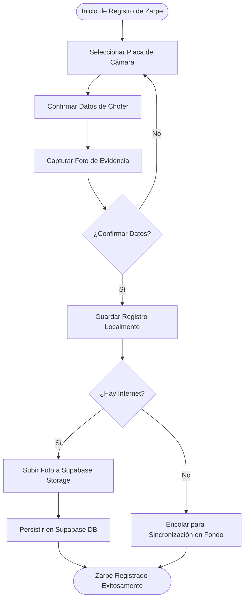

# Flujo 08: Zarpe de Cámara (Evidencia de Salida con Foto)

Este módulo especifica el proceso para registrar el zarpe (salida) de la cámara de transporte desde el muelle de partida. Su propósito es contar con evidencia visual (fotografía) de que la unidad de transporte ha iniciado el traslado del producto.

---

## 🎯 Objetivo
Registrar la salida de la cámara de transporte (vehículo) asociando una fotografía como evidencia obligatoria, capturando la marca de tiempo, placa del vehículo, chofer y el muelle de partida.

---

## 🗺️ Flujo del Proceso

---

## 📝 Especificación Técnica

### 1. Datos a Registrar
- **ID de Zarpe**: UUID v4 auto-generado.
- **Placa de la Cámara**: Clave externa a la tabla de transporte/cámara.
- **Chofer**: Nombre del chofer a cargo.
- **Muelle de Partida**: Ubicación del muelle de salida.
- **Foto de Evidencia**: Archivo de imagen o múltiples rutas separadas por comas (JPG/PNG).
- **Fecha y Hora de Zarpe**: Marca de tiempo del registro local (`timestamp`).
- **Estado de Sincronización**: Rastreable en SQLite local con la columna `sincronizado` (`0` = pendiente, `1` = sincronizado).
- **Estado de Negocio**:
  * `DESPACHADO_PIURA`: Estado inicial configurado al registrarse el despacho en la App Móvil.
  * `RECIBIDO_LAMBAYEQUE`: Estado final actualizado desde el Dashboard Administrativo Web al recibir la unidad de transporte en la planta de destino.

### 2. Comportamiento Offline-First y Sincronización
- **Persistencia Local (Upstream):** La cámara se registra primero en SQLite local con estado `sincronizado = 0` y `estado = 'DESPACHADO_PIURA'`. Al recuperar conexión, el gestor de sincronización sube las imágenes a Supabase Storage y persiste la fila en la tabla remota `zarpes`.
- **Actualización de Negocio (Downstream):** La App Móvil descarga periódicamente los cambios de estado del negocio desde Supabase. Si una cámara ha sido marcada como recibida (`RECIBIDO_LAMBAYEQUE`) en la consola administrativa Web, este estado se replica a SQLite local.
- **Exclusión por Ciclo de Vida:** Para evitar registros redundantes y mantener la integridad operativa del muelle, la lista de selección de zarpes disponibles en el formulario de pesca excluye aquellos registros locales que ya hayan sido marcados como `RECIBIDO_LAMBAYEQUE`.
