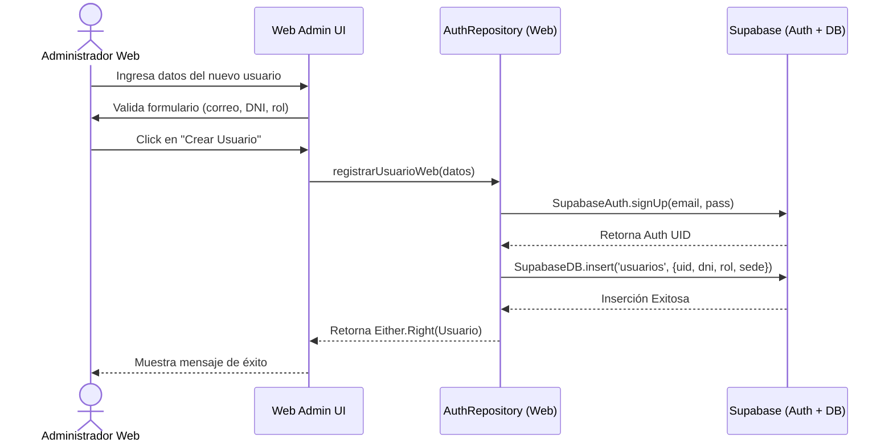

# FLUJO 09: CREACIÓN DE USUARIOS (WEB)

## Descripción General
Este flujo documenta el proceso mediante el cual un Administrador utiliza el Panel Web (`brismar_web_admin`) para registrar a nuevos usuarios en la plataforma Brismar (Pescadores, Patrones, Supervisores). 

## Roles Involucrados
- **Super Administrador (Web):** Tiene permisos absolutos para crear cualquier tipo de rol.
- **Supervisor de Sede (Web):** Puede crear perfiles operativos (Pescadores) para su sede específica.

## Diagrama BPMN (Teórico)

## Reglas de Negocio (Clean Architecture)
1. **Separación de Responsabilidades:** El Repositorio de la Web **solo** interactúa con Supabase, a diferencia de la App que interactúa con SQLite primero.
2. **Atomicidad:** Si se crea el usuario en `Supabase Auth` pero falla la inserción en la tabla pública `usuarios`, se debe hacer un *rollback* (eliminar el Auth UID) o manejar el error en la capa de Datos (Data Source).
3. **Seguridad (RLS):** Las políticas de Supabase (RLS) garantizan que un Supervisor de Paita no pueda crear usuarios para Bayóvar.
