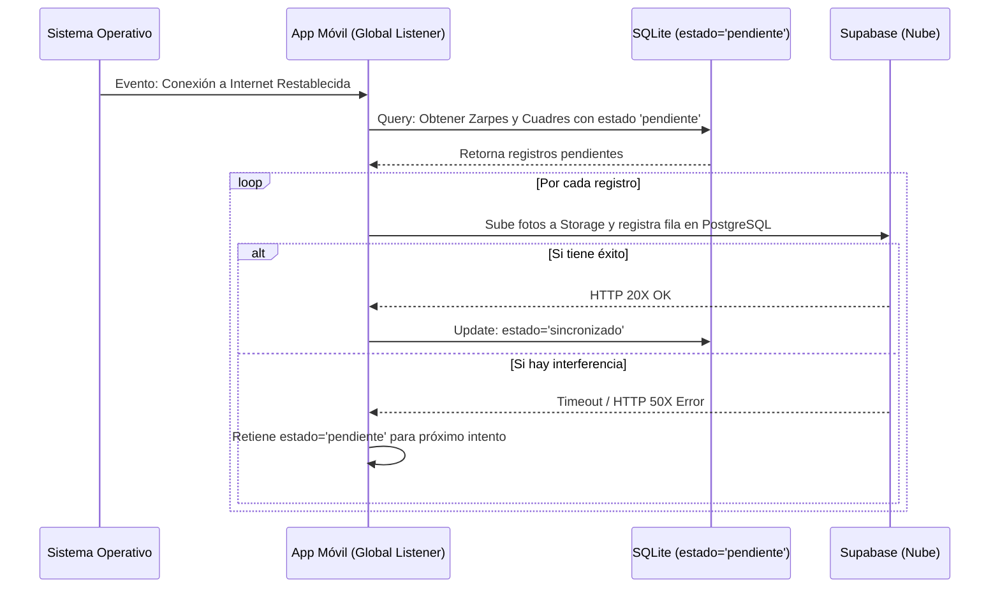

# FLUJO 10: SINCRONIZACIÓN BIDIRECCIONAL (WEB <-> APP MÓVIL)

## Descripción General
Este flujo define la mecánica mediante la cual los datos se sincronizan entre la App Móvil (`brismar_app`) y la Web (Supabase).
- **Downstream (Web -> App):** Usuarios, catalogos, actualizados desde la nube a SQLite (Offline-First).
- **Upstream (App -> Web):** Cuadres y Zarpes creados offline que viajan a Supabase cuando se recupera internet.

## Estrategia de Sincronización Automática (Upstream)
La aplicación móvil escucha activamente los cambios de red utilizando `connectivity_plus`. Cuando detecta que el internet (WiFi o Datos) ha vuelto, lanza un proceso de sincronización en segundo plano ("Auto-Sync").

### Diagrama BPMN (Zarpes y Cuadres Offline)

## Reglas de Negocio (Offline-First)
1. **Inteligencia de Estados:** El filtro principal es la columna `estado`. La base de datos local nunca sube datos repetidos porque ignora los que están como `sincronizado`.
2. **Tolerancia a Fallos:** Si la subida de un Zarpe a Supabase es interrumpida a mitad de camino, el error es atrapado en un bloque seguro. No se actualiza SQLite a menos que Supabase confirme la recepción completa, evitando pérdida de información.
3. **Módulo Transversal:** El listener global vive en el widget raíz (`MyApp` en `main.dart`) para garantizar que la reconexión se capture sin importar en qué pantalla esté el usuario.
