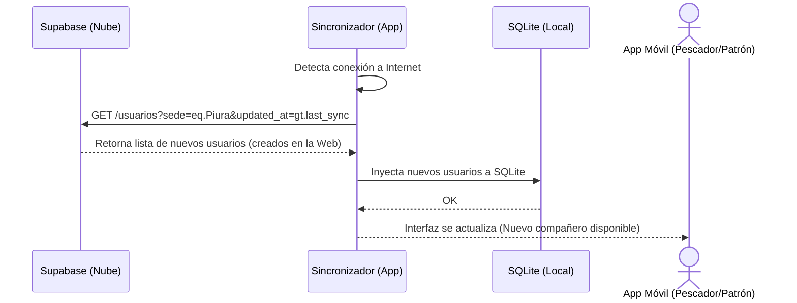

# FLUJO 10: SINCRONIZACIÓN DE USUARIOS (WEB -> APP MÓVIL)

## Descripción General
Este flujo define la mecánica mediante la cual un usuario creado en la Web (Supabase) viaja hacia los dispositivos móviles (`brismar_app`) para ser almacenado en sus bases de datos locales (SQLite) y permitir la operación "Offline-First".

## Estrategia de Sincronización
La aplicación móvil no descarga toda la base de datos de Supabase. Descarga **solo** la información relevante para la sede o rol del usuario logueado en el dispositivo.

## Diagrama BPMN (Teórico)

## Reglas de Negocio (Offline-First)
1. **Timestamp (Marcas de Tiempo):** La app móvil debe guardar la fecha de su última sincronización (`last_sync`). Al volver a tener internet, solo pedirá a Supabase los usuarios cuyo `updated_at` sea mayor a ese `last_sync`. (Evita descargar la base de datos entera repetidamente).
2. **Conflictos:** En la entidad `Usuario`, la Web es la "Fuente de la Verdad". Si hay un conflicto, los datos de Supabase sobrescriben los de SQLite local.
3. **Módulo Transversal:** Esta lógica debe vivir en el `nucleo/sincronizacion/` de la app móvil, y debe ser transparente para el usuario final (ocurre en background o al iniciar la app).
