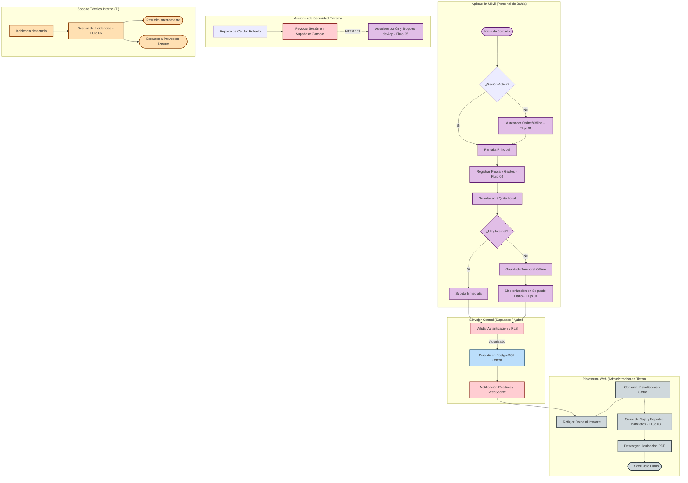

# Flujo General: Ciclo de Operación de Pesca, Sincronización y Cierre Financiero (Brismar)

Este documento describe el flujo de proceso general y unificado de la suite **Brismar**. Representa la orquestación e interacción de todas las partes del sistema: la aplicación móvil (operada por el Personal de Bahía), la base de datos local y su lógica de sincronización, la nube de Supabase (servidor central), el Dashboard Web administrativo (operado por el Administrador en Tierra) y el proceso interno de soporte TI.

---

## 🗺️ Mapa General de Procesos e Interacciones

El siguiente diagrama de alto nivel ilustra cómo fluye la información a través de los diferentes subsistemas e involucrados:

---

## 📊 Especificación Técnica de las Etapas del Negocio

El ciclo completo se subdivide en seis fases lógicas que aseguran la tolerancia a fallos, la consistencia y la seguridad del sistema:

### Fase 1: Inicio y Autenticación Offline-First
*   **Inicio:** El usuario inicia sesión al comenzar su turno en el muelle.
*   **Seguridad Local:** La app valida contra el hash almacenado con seguridad mediante BCrypt en el dispositivo para verificar el PIN de 4 dígitos.
*   **Sesión Online:** Si hay internet, valida las credenciales directamente con Supabase Auth y actualiza la clave encriptada localmente.
*   *Documento de Referencia:* [[FLUJO_01_AUTENTICACION]].

### Fase 2: Registro Operativo de Pesca y Gastos
*   **Operación:** El Personal de Bahía registra el pesaje del pescado por especie y los gastos asociados (hielo, transporte, fletes, etc.).
*   **Cálculo Local:** El dispositivo calcula de forma reactiva el balance antes de guardar, utilizando los controllers de Riverpod.
*   *Documento de Referencia:* [[FLUJO_02_REGISTRO_PESCA]].

### Fase 3: Persistencia Robusta y Sincronización en Segundo Plano

* **Offline-First:** Cada registro se persiste localmente generando un UUID v4 del cliente. De esta manera, no hay riesgo de duplicados o solapamientos.
* **Envío en Lote:** Si no hay internet, el Listener de `connectivity_plus` espera la señal de red. En cuanto se detecta conectividad, el gestor de sincronización realiza una subida masiva en lotes de los registros pendientes.
* *Documento de Referencia:* [[FLUJO_04_SINCRONIZACION_FONDO]].

### Fase 4: Consolidación y Generación de Reportes Financieros

* **Panel Administrativo:** El equipo administrativo visualiza las capturas en tiempo real gracias a los canales Realtime de Supabase (WebSockets).
* **Cálculo del Cierre:** El servidor Node.js/Express procesa las consultas agregadas para obtener la Utilidad Neta real de cada periodo operativo:
  $$\text{Utilidad Neta} = \sum (\text{kilos} \times \text{precio}) - \sum (\text{gastos})$$
* **Liquidaciones:** Se emite una liquidación oficial en formato PDF generada al vuelo mediante `pdfkit`.
* *Documento de Referencia:* [[FLUJO_03_REPORTE_FINANCIERO]].

### Fase 5: Protocolo de Contingencia de Seguridad

* **Bloqueo y Revocación:** Si un teléfono es robado, el administrador revoca sus credenciales en Supabase.
* **Bloqueo Local:** Al recibir la respuesta HTTP `401 Unauthorized` de Supabase, la app móvil cierra la sesión, elimina los datos locales temporales y bloquea el acceso rápido local (exigiendo login completo online).
* **Autodestrucción y SQLCipher:** La autodestrucción automática por intentos fallidos y el cifrado completo de archivos locales se consideran pendientes críticos para la fase de **seguridad avanzada** (posterior al MVP).
* *Documento de Referencia:* [[FLUJO_05_REVOCACION_ROBO]].

### Fase 6: Soporte y Gestión de Incidencias TI *(Nuevo)*

* **Detección:** Cualquier operario puede reportar una incidencia tecnológica que afecte la operación.
* **Clasificación:** El Técnico TI clasifica por impacto y urgencia (BAJA / MEDIA / ALTA).
* **Escalamiento estructurado**: N1 (Técnico) → N2 (Jefe TI) → N3 (Proveedor Externo, cierra proceso interno).
* **Confirmación del Operario**: El operario siempre valida que la solución funcionó antes del cierre del ticket.
* *Documento de Referencia:* [[FLUJO_06_GESTION_INCIDENCIAS_TI]].

### Ecosistema de Datos y Canales Operativos *(Regla de Negocio)*

*   **Supabase como Fuente de Verdad:** Toda la información consolidada de la App y de la Web debe persistirse en Supabase PostgreSQL.
*   **Rol de Excel:** BRISMAR no busca eliminar Excel, sino reducir la digitación manual y facilitar su uso mediante exportaciones, reportes y plantillas compatibles. La fuente principal de datos será Supabase, pero Excel seguirá siendo un formato operativo clave para análisis, entrega contable y trabajo administrativo en oficina.
*   **Erradicación de WhatsApp:** Se debe dejar de usar WhatsApp como canal operativo principal para envío y registro de datos (pesca, fletes, gastos), migrando esta operativa a la app y la plataforma web para evitar la pérdida de trazabilidad, el desorden y la falta de estructura.

---

## 🔗 Índice Completo de Flujos Documentados

| # | Flujo | Diagrama BPMN | Descripción Técnica |
| --- | --- | --- | --- |
| 01 | **Autenticación** | [BPMN](file:///home/jhonataningesis/Documentos/Brismar/BRISMAR_APP/docs/brismar_brain/diagramas_APP/FLUJO_01_AUTENTICACION.bpmn) | [Detalle](file:///home/jhonataningesis/Documentos/Brismar/BRISMAR_APP/docs/brismar_brain/flujos/FLUJO_01_AUTENTICACION.md) |
| 02 | **Registro de Pesca** | [BPMN](file:///home/jhonataningesis/Documentos/Brismar/BRISMAR_APP/docs/brismar_brain/diagramas_APP/FLUJO_02_REGISTRO_PESCA.bpmn) | [Detalle](file:///home/jhonataningesis/Documentos/Brismar/BRISMAR_APP/docs/brismar_brain/flujos/FLUJO_02_REGISTRO_PESCA.md) |
| 03 | **Reportes Financieros** | [BPMN](file:///home/jhonataningesis/Documentos/Brismar/BRISMAR_APP/docs/brismar_brain/diagramas_APP/FLUJO_03_REPORTE_FINANCIERO.bpmn) | [Detalle](file:///home/jhonataningesis/Documentos/Brismar/BRISMAR_APP/docs/brismar_brain/flujos/FLUJO_03_REPORTE_FINANCIERO.md) |
| 04 | **Sincronización en Fondo** | [BPMN](file:///home/jhonataningesis/Documentos/Brismar/BRISMAR_APP/docs/brismar_brain/diagramas_APP/FLUJO_04_SINCRONIZACION_FONDO.bpmn) | [Detalle](file:///home/jhonataningesis/Documentos/Brismar/BRISMAR_APP/docs/brismar_brain/flujos/FLUJO_04_SINCRONIZACION_FONDO.md) |
| 05 | **Revocación por Robo** | [BPMN](file:///home/jhonataningesis/Documentos/Brismar/BRISMAR_APP/docs/brismar_brain/diagramas_APP/FLUJO_05_REVOCACION_ROBO.bpmn) | [Detalle](file:///home/jhonataningesis/Documentos/Brismar/BRISMAR_APP/docs/brismar_brain/flujos/FLUJO_05_REVOCACION_ROBO.md) |
| 06 | **Gestión de Incidencias TI** | [BPMN](file:///home/jhonataningesis/Documentos/Brismar/BRISMAR_APP/docs/brismar_brain/diagramas_TI/gestion_incidencias_TI.bpmn) | [Detalle](file:///home/jhonataningesis/Documentos/Brismar/BRISMAR_APP/docs/brismar_brain/flujos/FLUJO_06_GESTION_INCIDENCIAS_TI.md) |

---

## 🧠 Flujos Candidatos para Generación Futura

> Esta sección está pensada para ser analizada por **Notebook LM** y proponer qué nuevos flujos documentar según los patrones y brechas del sistema actual.

Los siguientes procesos existen implícitamente en el código o en la operación, pero **aún no tienen flujo formal documentado**:

### 🟡 Alta prioridad — Procesos ya implementados sin flujo

| # | Nombre sugerido | Descripción del proceso | Flujos relacionados |
| --- | --- | --- | --- |
| 07 | **Flujo de Onboarding de Nuevo Usuario** | Desde que el administrador crea la cuenta en Supabase hasta que el Personal de Bahía realiza su primer registro de pesca exitoso | F01, F02 |
| 08 | **Flujo de Cierre de Jornada y Cuadre de Caja** | Proceso del administrador en tierra para cuadrar los registros del día, detectar discrepancias y cerrar la jornada operativa | F02, F03 |
| 09 | **Flujo de Actualización de la App (OTA / Store)** | Cómo se gestiona la distribución de una nueva versión de la app: notificación al usuario, descarga, migración de esquema SQLite y validación sin pérdida de datos offline | F04 |

### 🟠 Media prioridad — Procesos operativos clave sin documentar

| # | Nombre sugerido | Descripción del proceso | Flujos relacionados |
| --- | --- | --- | --- |
| 10 | **Flujo de Corrección de Registro Erróneo** | Cómo un operario puede enmendar un registro de pesca ya guardado localmente (antes de sincronizar) o solicitar corrección al administrador (después de sincronizar) | F02, F03 |
| 11 | **Flujo de Gestión de Múltiples Embarcaciones** | Cómo un solo operario gestiona el registro de faenas de varias embarcaciones en un mismo turno | F02 |
| 12 | **Flujo de Alertas y Notificaciones Push** | Cuándo y cómo el sistema envía notificaciones push (sincronización exitosa, fallo crítico, liquidación disponible) | F03, F04 |

### 🔵 Para explorar — Procesos futuros o de mejora

| # | Nombre sugerido | Descripción del proceso | Notas |
| --- | --- | --- | --- |
| 13 | **Flujo de Auditoría y Trazabilidad** | Registro de quién modificó qué y cuándo para fines de auditoría financiera | Requiere tabla `audit_log` en Supabase |
| 14 | **Flujo de Backup y Recuperación de Datos** | Política de respaldo de la base de datos Supabase y recuperación ante desastre | Proceso de TI + Supabase |
| 15 | **Flujo de Gestión de Permisos y Roles** | Cómo se asignan, modifican o revocan permisos de usuario (roles en Supabase RLS) | Administrador en tierra |
| 16 | **Flujo de Migración de Esquema SQLite** | Proceso de migración de la base de datos local cuando cambia el esquema en una actualización | F09 |

---

## 💡 Preguntas Guía para Notebook LM

Al cargar esta documentación en Notebook LM, puedes hacer las siguientes preguntas para generar valor:

1. *"¿Qué flujos tienen dependencias con Supabase y cuáles podrían funcionar completamente offline?"*
2. *"¿En qué flujos existe riesgo de pérdida de datos si el dispositivo se apaga inesperadamente?"*
3. *"¿Qué flujo debería documentarse primero si el equipo quiere mejorar la experiencia del administrador en tierra?"*
4. *"¿Hay inconsistencias entre el Flujo 01 de autenticación y el Flujo 05 de revocación por robo?"*
5. *"¿Qué flujo cubre el escenario de un operario que cambia de dispositivo sin perder sus datos históricos?"*
6. *"Analiza la cobertura de los flujos existentes e identifica qué casos de uso de alta mar no están documentados."*
