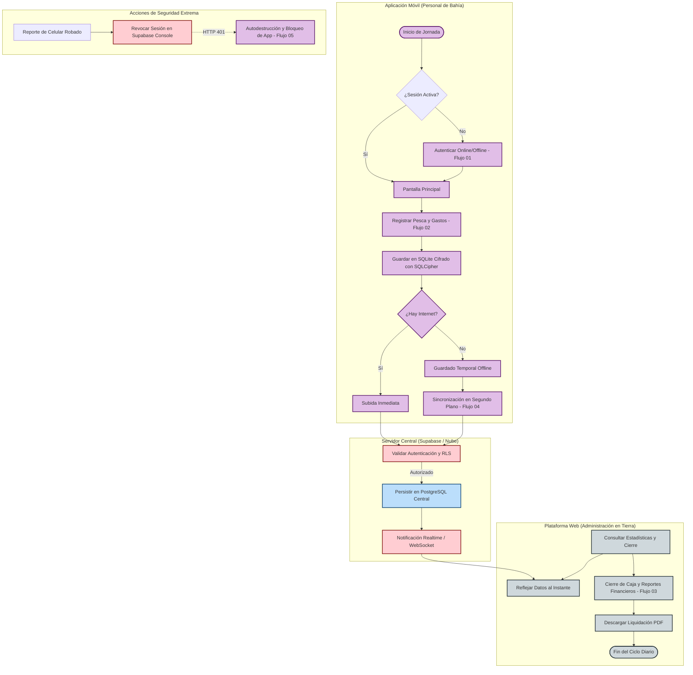

# Flujo General: Ciclo de Operación de Pesca, Sincronización y Cierre Financiero (Brismar)

Este documento describe el flujo de proceso general y unificado de la suite **Brismar**. Representa la orquestación e interacción de todas las partes del sistema: la aplicación móvil (operada por el Personal de Bahía), la base de datos local y su lógica de sincronización, la nube de Supabase (servidor central) y el Dashboard Web administrativo (operado por el Administrador en Tierra).

---

## 🗺️ Mapa General de Procesos e Interacciones

El siguiente diagrama de alto nivel ilustra cómo fluye la información a través de los diferentes subsistemas e involucrados:

---

## 📊 Especificación Técnica de las Etapas del Negocio

El ciclo completo se subdivide en cinco fases lógicas que aseguran la tolerancia a fallos, la consistencia y la seguridad del sistema:

### Fase 1: Inicio y Autenticación Offline-First
*   **Inicio:** El usuario inicia sesión al comenzar su turno en el muelle.
*   **Seguridad Local:** La app valida contra el hash almacenado con seguridad mediante BCrypt en el dispositivo para verificar el PIN de 4 dígitos.
*   **Sesión Online:** Si hay internet, valida las credenciales directamente con Supabase Auth y actualiza la clave encriptada localmente.
*   *Documento de Referencia:* [[FLUJO_01_AUTENTICACION]].

### Fase 2: Registro Operativo de Pesca y Gastos
*   **Operación:** El Personal de Bahía registra el pesaje del pescado por especie y los gastos asociados (hielo, transporte, fletes, etc.).
*   **Cálculo Local:** El dispositivo calcula de forma reactiva el balance antes de guardar, utilizando los controllers de Riverpod.
*   *Documento de Referencia:* [[FLUJO_02_REGISTRO_PESCA]].

### Fase 3: Persistencia Robusta y Sincronización en Segundo Plano
*   **Offline-First:** Cada registro se persiste localmente generando un UUID v4 del cliente. De esta manera, no hay riesgo de duplicados o solapamientos.
*   **Envío en Lote:** Si no hay internet, el Listener de `connectivity_plus` espera la señal de red. En cuanto se detecta conectividad, el gestor de sincronización realiza una subida masiva en lotes de los registros pendientes.
*   *Documento de Referencia:* [[FLUJO_04_SINCRONIZACION_FONDO]].

### Fase 4: Consolidación y Generación de Reportes Financieros
*   **Panel Administrativo:** El equipo administrativo visualiza las capturas en tiempo real gracias a los canales Realtime de Supabase (WebSockets).
*   **Cálculo del Cierre:** El servidor Node.js/Express procesa las consultas agregadas para obtener la Utilidad Neta real de cada periodo operativo:
    $$\text{Utilidad Neta} = \sum (\text{kilos} \times \text{precio}) - \sum (\text{gastos})$$
*   **Liquidaciones:** Se emite una liquidación oficial en formato PDF generada al vuelo mediante `pdfkit`.
*   *Documento de Referencia:* [[FLUJO_03_REPORTE_FINANCIERO]].

### Fase 5: Protocolo de Contingencia de Seguridad
*   **Bloqueo y Autodestrucción:** Si un teléfono es robado, el administrador revoca sus credenciales en Supabase.
*   **Autodestrucción:** Al recibir la respuesta HTTP `401 Unauthorized` de Supabase, la app móvil elimina la llave de cifrado de SQLCipher, borra los archivos locales y bloquea permanentemente la aplicación mostrando una pantalla roja de alerta de seguridad.
*   *Documento de Referencia:* [[FLUJO_05_REVOCACION_ROBO]].

---

## 🔗 Enlaces Rápidos a Flujos Individuales

| Flujo | Diagrama BPMN | Descripción Técnica |
|---|---|---|
| **Flujo 01: Autenticación** | [BPMN](file:///c:/BRISMAR_APP/docs/brismar_brain/diagramas/FLUJO_01_AUTENTICACION.bpmn) | [Detalle Técnico](file:///c:/BRISMAR_APP/docs/brismar_brain/flujos/FLUJO_01_AUTENTICACION.md) |
| **Flujo 02: Registro de Pesca** | [BPMN](file:///c:/BRISMAR_APP/docs/brismar_brain/diagramas/FLUJO_02_REGISTRO_PESCA.bpmn) | [Detalle Técnico](file:///c:/BRISMAR_APP/docs/brismar_brain/flujos/FLUJO_02_REGISTRO_PESCA.md) |
| **Flujo 03: Reportes Financieros** | [BPMN](file:///c:/BRISMAR_APP/docs/brismar_brain/diagramas/FLUJO_03_REPORTE_FINANCIERO.bpmn) | [Detalle Técnico](file:///c:/BRISMAR_APP/docs/brismar_brain/flujos/FLUJO_03_REPORTE_FINANCIERO.md) |
| **Flujo 04: Sincronización** | [BPMN](file:///c:/BRISMAR_APP/docs/brismar_brain/diagramas/FLUJO_04_SINCRONIZACION_FONDO.bpmn) | [Detalle Técnico](file:///c:/BRISMAR_APP/docs/brismar_brain/flujos/FLUJO_04_SINCRONIZACION_FONDO.md) |
| **Flujo 05: Revocación por Robo** | [BPMN](file:///c:/BRISMAR_APP/docs/brismar_brain/diagramas/FLUJO_05_REVOCACION_ROBO.bpmn) | [Detalle Técnico](file:///c:/BRISMAR_APP/docs/brismar_brain/flujos/FLUJO_05_REVOCACION_ROBO.md) |
